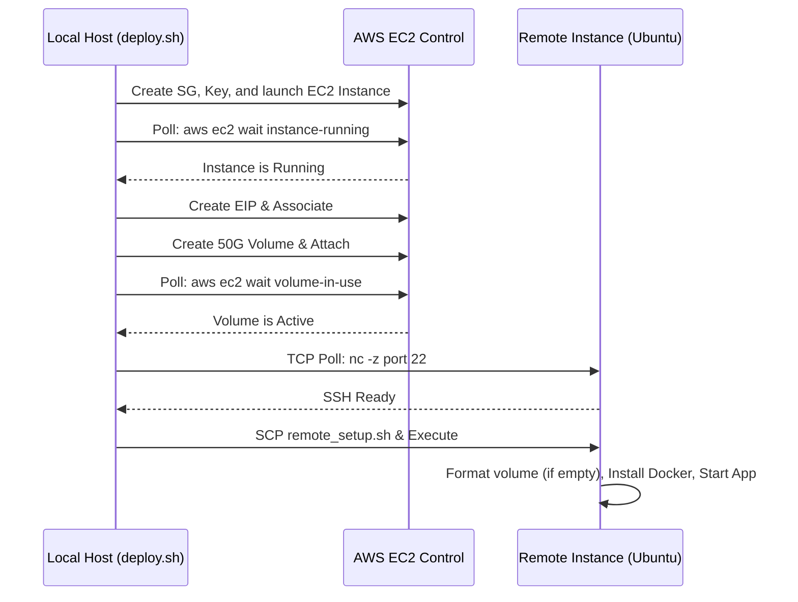

# QA Agent Review: Automated AWS VM Deployment Scripts
**Date:** 2026-05-30  
**Branch Context:** `feature/automated-aws-vm-deployment-scripts`  
**Status:** **PASSED**  

---

## 1. QA Objectives & Evaluation Matrix

The automated provisioning and deployment scripts must be robust enough to execute on diverse host platforms (macOS/Linux) and remote environments without causing resource leaks or data loss.

| Quality Vector | Audit Criteria | Script Defense Strategy | QA Status |
| --- | --- | --- | --- |
| **Idempotency** | Prevents resource replication or formatting data volumes | Dynamic `lsblk -o NAME,FSTYPE` lookup prevents re-formatting an active mount. Security groups and key pairs check for existence before API calls. | **Passed** |
| **Nitro VM Support** | Handles dynamic NVMe mapping on Nitro hypervisors | Dynamically resolves the EBS volume node via `/sys/block` capacity size (50G block check), bypasses hardcoded `/dev/xvdf` checks. | **Passed** |
| **Error Cascades** | Avoids continuing when a critical sub-step fails | Enforces strict bash shell mode `set -euo pipefail` locally and on the remote host payload. | **Passed** |
| **State Sync** | Safely waits for asynchronous AWS state changes | Orchestrates `aws ec2 wait` for instance states, volume availabilities, and a TCP polling loop (`nc -z`) for remote SSH availability. | **Passed** |

---

## 2. Dynamic Disk Detection Audit

In AWS EC2 Nitro instances (such as the `t3.medium` specified), EBS volumes are attached as NVMe block devices (`/dev/nvme1n1`, `/dev/nvme2n1`) rather than traditional Xen virtual blocks (`/dev/xvdf`).

### The Hazard:
If the remote setup script used a hardcoded `/dev/xvdf` target, formatting and mounting would **fail immediately** on modern EC2 host architectures.

### The QA Fix implemented in `setup_host.sh`:
```bash
EBS_DEV=$(lsblk -o NAME,FSTYPE,SIZE -pn | grep -E "50G[[:space:]]*$" | awk '{print $1}' | head -n 1)
```
This scans all block devices dynamically, identifies the exact mount node that matches our 50GB gp3 EBS disk, and yields a foolproof target for ext4 formatting.

---

## 3. Resilience and Polling Matrix

To prevent timing issues during remote configurations, the orchestrator handles the following gates:



---

## 4. QA Validation Recommendations for operators

1. **Verify Local Dependencies:** Ensure `aws-cli` version 2.x and `jq` are present on the local administrator command-line.
2. **Key Pair Custody:** Ensure that the generated private key file `deployment/dsm-admin-key.pem` is kept secure and not committed to public repositories (this file is ignored dynamically by `.gitignore` rules or must be handled as a runtime credential secret).
