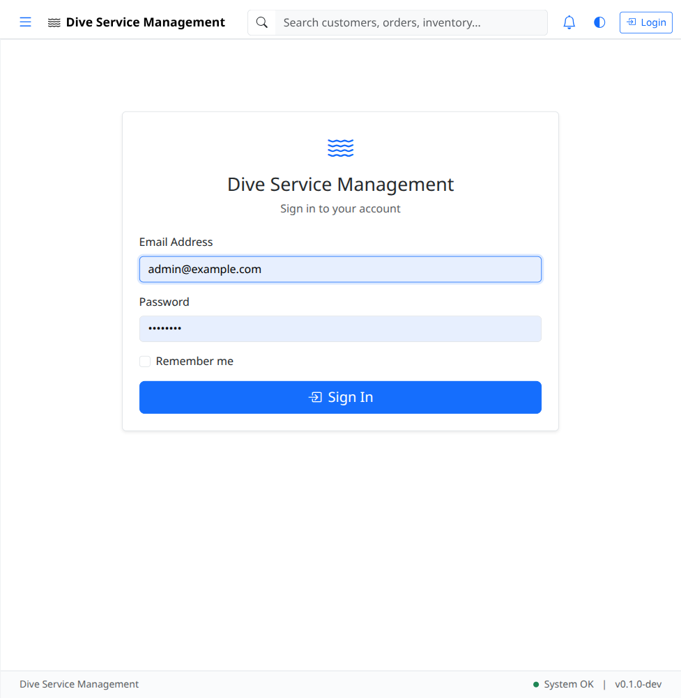
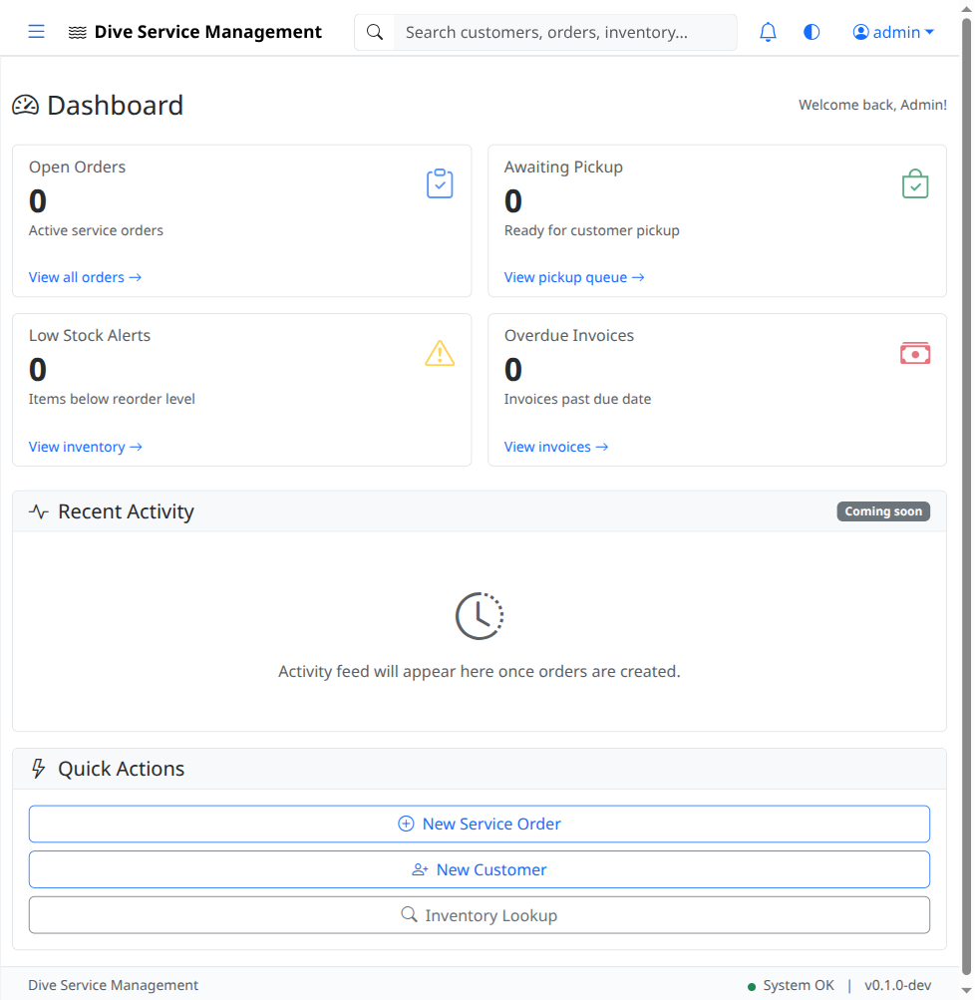

# UAT-01: Authentication & Authorization

| Field            | Value                                      |
|------------------|--------------------------------------------|
| **UAT Script**   | UAT-01                                     |
| **Feature**      | Authentication & Authorization             |
| **Version**      | 1.0                                        |
| **Date Created** | 2026-03-04                                 |
| **Estimated Time** | 15 minutes                               |
| **Prerequisites** | Application running at http://localhost:8080 |
| **Test Account** | admin@example.com / admin123, tech@example.com / tech123, viewer@example.com / viewer123 |

---

## Objective

Verify that users can log in with valid credentials, are redirected appropriately, see role-appropriate navigation, and are prevented from accessing unauthorized features. Verify that invalid credentials are rejected.

---

## Test Steps

### TC-01.1: Verify Login Page Loads

1. Open a browser and navigate to **http://localhost:8080/login**.
2. Verify the login page loads with the following elements:
   - Email input field
   - Password input field
   - "Remember Me" checkbox
   - "Sign In" button

- [ ] **Step passed** -- Login page loads with all expected elements

---

### TC-01.2: Admin Login - Valid Credentials

1. On the login page, enter the following credentials:
   - **Email:** `admin@example.com`
   - **Password:** `admin123`
2. Click the **Sign In** button.
3. Verify you are redirected to the **Dashboard** page.
4. Verify the dashboard displays a greeting: **"Welcome back, Admin!"** (or similar welcome message).

- [ ] **Step passed** -- Admin login succeeds and redirects to Dashboard
- [ ] **Step passed** -- Welcome message displays correctly

---

### TC-01.3: Verify Admin Sidebar Navigation

1. While logged in as admin, examine the left sidebar navigation.
2. Verify the following menu items are visible:
   - Dashboard
   - Customers
   - Orders
   - Inventory
   - Price List
   - Invoices
   - Reports
   - Tools
   - Admin

- [ ] **Step passed** -- All sidebar menu items are visible for admin role

---

### TC-01.4: Verify User Dropdown

1. Look at the top-right corner of the page.
2. Verify a user dropdown or indicator shows **"admin"** (the current user's name or email).
3. Click the user dropdown.
4. Verify a **Logout** option is available.

- [ ] **Step passed** -- User dropdown displays "admin" and contains Logout option

---

### TC-01.5: Admin Logout

1. Click the user dropdown in the top-right corner.
2. Click **Logout**.
3. Verify you are redirected to the **login page** at `/login`.
4. Verify you are no longer authenticated (attempting to navigate to `/` or `/dashboard` redirects back to login).

- [ ] **Step passed** -- Logout redirects to login page
- [ ] **Step passed** -- Authenticated routes are no longer accessible

---

### TC-01.6: Tech Login - Restricted Sidebar

1. On the login page, enter the following credentials:
   - **Email:** `tech@example.com`
   - **Password:** `tech123`
2. Click the **Sign In** button.
3. Verify you are redirected to the Dashboard.
4. Examine the left sidebar navigation.
5. Verify the **Admin** section is **NOT visible** in the sidebar.
6. Verify other navigation items (Dashboard, Customers, Orders, Inventory, etc.) are still visible as appropriate for the tech role.

- [ ] **Step passed** -- Tech login succeeds
- [ ] **Step passed** -- Admin section is NOT visible in sidebar for tech role

---

### TC-01.7: Tech Logout

1. Click the user dropdown and select **Logout**.
2. Verify you are redirected to the login page.

- [ ] **Step passed** -- Tech user can log out successfully

---

### TC-01.8: Viewer Login - Read-Only Access

1. On the login page, enter the following credentials:
   - **Email:** `viewer@example.com`
   - **Password:** `viewer123`
2. Click the **Sign In** button.
3. Verify you are redirected to the Dashboard.
4. Navigate to the **Customers** page.
5. Verify that **"Add Customer"** button is **NOT visible** or is disabled.
6. Navigate to the **Orders** page.
7. Verify that **"New Order"** button is **NOT visible** or is disabled.
8. Navigate to the **Inventory** page.
9. Verify that **"Add Item"** button is **NOT visible** or is disabled.
10. If you click on a customer or order detail, verify that **"Edit"** button is **NOT visible** or is disabled.

- [ ] **Step passed** -- Viewer login succeeds
- [ ] **Step passed** -- No Add/Create buttons visible on Customers page
- [ ] **Step passed** -- No Add/Create buttons visible on Orders page
- [ ] **Step passed** -- No Add/Create buttons visible on Inventory page
- [ ] **Step passed** -- No Edit buttons visible on detail pages

---

### TC-01.9: Viewer Logout

1. Click the user dropdown and select **Logout**.
2. Verify you are redirected to the login page.

- [ ] **Step passed** -- Viewer user can log out successfully

---

### TC-01.10: Invalid Password - Error Handling

1. On the login page, enter the following credentials:
   - **Email:** `admin@example.com`
   - **Password:** `wrongpassword`
2. Click the **Sign In** button.
3. Verify you **remain on the login page** (no redirect).
4. Verify an error message appears, such as **"Invalid password"** or **"Invalid credentials"**.

- [ ] **Step passed** -- Invalid password keeps user on login page
- [ ] **Step passed** -- Error message is displayed clearly

---

### TC-01.11: Invalid Email - Error Handling

1. On the login page, enter the following credentials:
   - **Email:** `nonexistent@example.com`
   - **Password:** `admin123`
2. Click the **Sign In** button.
3. Verify you **remain on the login page**.
4. Verify an appropriate error message appears.

- [ ] **Step passed** -- Invalid email keeps user on login page
- [ ] **Step passed** -- Error message is displayed

---

## Test Summary

| Test Case | Description                        | Pass | Fail | Notes |
|-----------|------------------------------------|------|------|-------|
| TC-01.1   | Login page loads                   |      |      |       |
| TC-01.2   | Admin login - valid credentials    |      |      |       |
| TC-01.3   | Admin sidebar navigation           |      |      |       |
| TC-01.4   | User dropdown                      |      |      |       |
| TC-01.5   | Admin logout                       |      |      |       |
| TC-01.6   | Tech login - restricted sidebar    |      |      |       |
| TC-01.7   | Tech logout                        |      |      |       |
| TC-01.8   | Viewer login - read-only access    |      |      |       |
| TC-01.9   | Viewer logout                      |      |      |       |
| TC-01.10  | Invalid password error             |      |      |       |
| TC-01.11  | Invalid email error                |      |      |       |

---

## Notes

_Space for tester comments, observations, and issues encountered:_

    

---

**Tester Name:** ____________________
**Date Tested:** ____________________
**Overall Result:** PASS / FAIL
