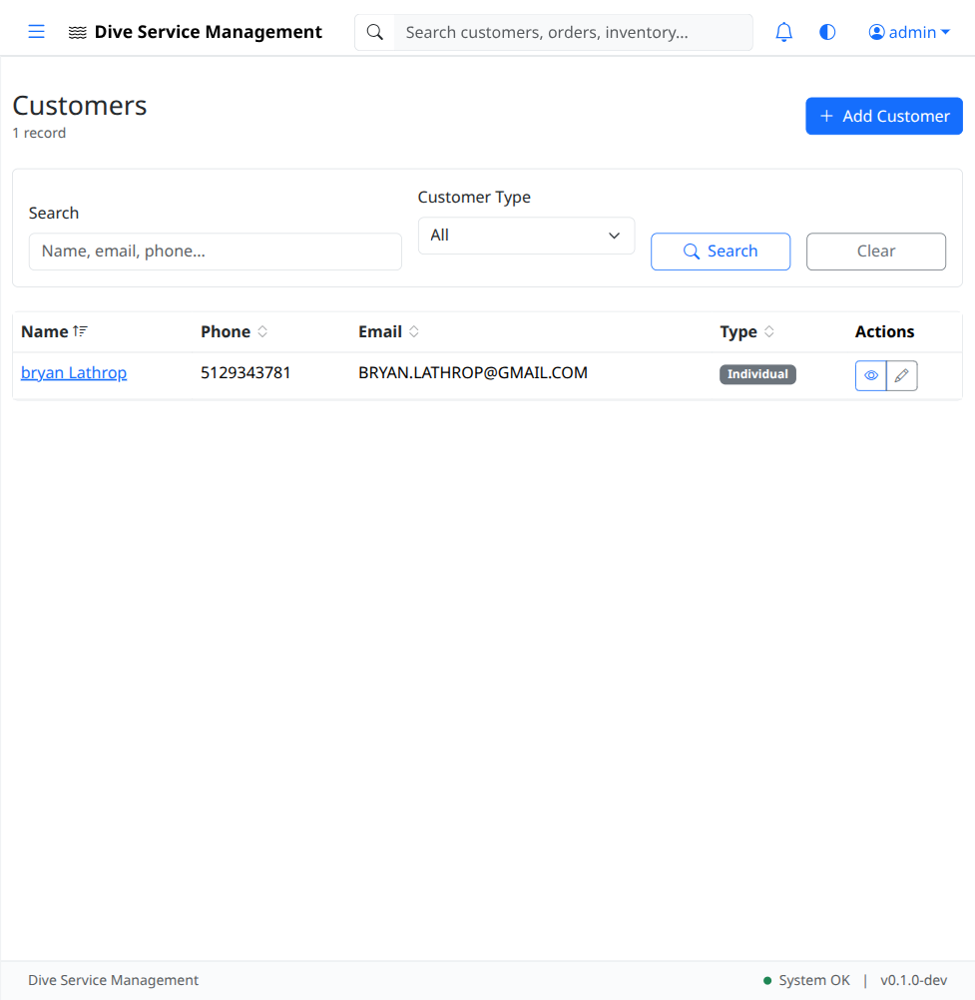
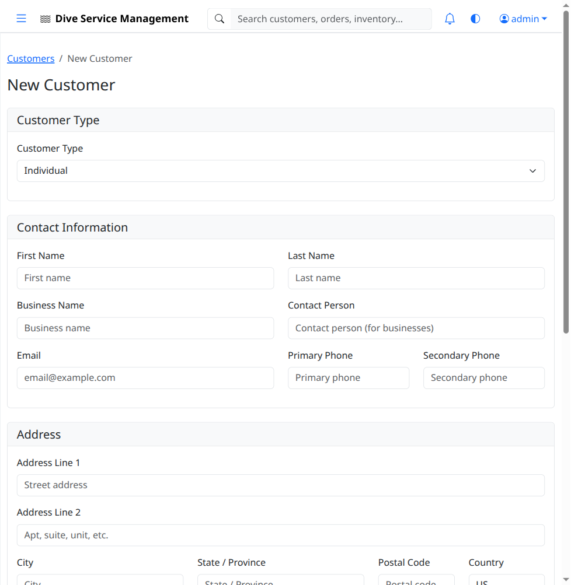
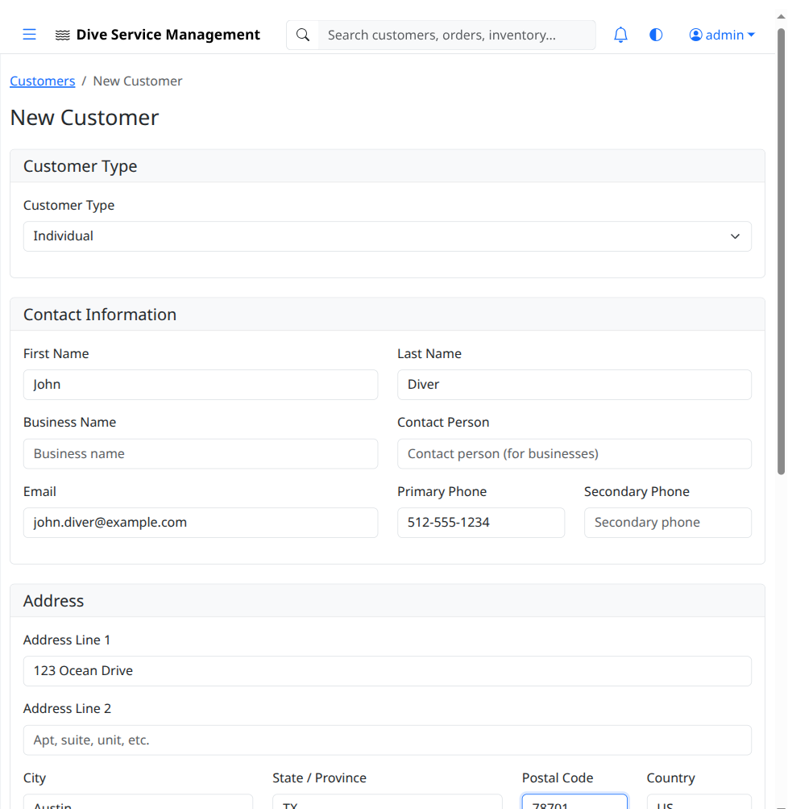
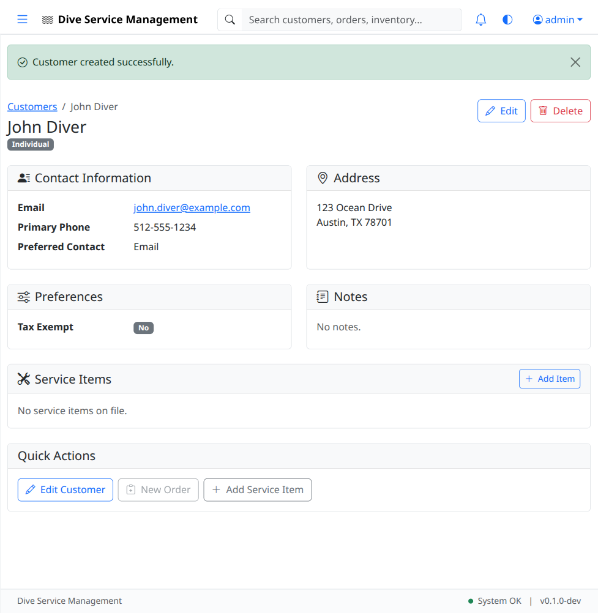

# UAT-02: Customer Management

| Field            | Value                                      |
|------------------|--------------------------------------------|
| **UAT Script**   | UAT-02                                     |
| **Feature**      | Customer Management                        |
| **Version**      | 1.0                                        |
| **Date Created** | 2026-03-04                                 |
| **Estimated Time** | 20 minutes                               |
| **Prerequisites** | UAT-01 completed (authentication works); Application running at http://localhost:8080 |
| **Test Account** | admin@example.com / admin123 (primary), viewer@example.com / viewer123 (read-only verification) |

---

## Objective

Verify that customers can be created, viewed, edited, and listed. Verify that the customer form captures all required fields, that validation works correctly, and that role-based access control restricts viewer accounts from creating or editing customers.

---

## Test Steps

### TC-02.1: Navigate to Customer List

1. Log in as **admin@example.com** / **admin123**.
2. Click **Customers** in the left sidebar.
3. Verify the customers list page loads.
4. Verify the page displays a table or list of existing customers (may be empty in a fresh database).
5. Verify an **"Add Customer"** button is visible.

- [ ] **Step passed** -- Customers list page loads
- [ ] **Step passed** -- "Add Customer" button is visible

---

### TC-02.2: Open Customer Form

1. Click the **"Add Customer"** button.
2. Verify the customer creation form loads.
3. Verify the form contains the following sections/fields:
   - **Customer Type** (e.g., Individual, Business)
   - **Contact Information** -- First Name, Last Name, Email, Phone
   - **Address** -- Street Address, City, State, Zip Code
   - **Preferences** (if applicable)
   - **Notes** (free-text area)

- [ ] **Step passed** -- Customer form loads with all expected fields

---

### TC-02.3: Fill In and Save New Customer

1. Fill in the form with the following data:
   - **First Name:** `John`
   - **Last Name:** `Diver`
   - **Email:** `john.diver@example.com`
   - **Phone:** `512-555-1234`
   - **Address:** `123 Ocean Drive`
   - **City:** `Austin`
   - **State:** `TX`
   - **Zip:** `78701`
2. Leave other fields at their defaults or fill as appropriate.

3. Click **"Save Customer"** (or equivalent submit button).
4. Verify a **success flash message** appears (e.g., "Customer created successfully").
5. Verify you are redirected to the **customer detail page** showing the newly created customer's information.

- [ ] **Step passed** -- Form accepts all entered data
- [ ] **Step passed** -- Success message appears after save
- [ ] **Step passed** -- Customer detail page displays correct information

---

### TC-02.4: Verify Customer in List

1. Navigate back to the **Customers** list (click Customers in sidebar).
2. Verify that **"John Diver"** appears in the customer list.
3. Verify that the email and/or phone number are displayed in the list row.

- [ ] **Step passed** -- New customer appears in the customers list

---

### TC-02.5: View Customer Detail

1. Click on **"John Diver"** (the customer name) in the list.
2. Verify the customer detail page loads.
3. Verify all fields match what was entered:
   - Name: John Diver
   - Email: john.diver@example.com
   - Phone: 512-555-1234
   - Address: 123 Ocean Drive, Austin, TX 78701
4. Verify the detail page includes sections for associated items, orders, and invoices (these may be empty).

- [ ] **Step passed** -- Customer detail page shows all correct information
- [ ] **Step passed** -- Associated items/orders/invoices sections are present

---

### TC-02.6: Edit Customer

1. On the customer detail page for "John Diver", click the **"Edit"** button.
2. Verify the edit form loads pre-populated with the customer's current data.
3. Change the **Phone** field to `512-555-9999`.
4. Click **"Save Customer"** (or equivalent submit button).
5. Verify a success flash message appears.
6. Verify the customer detail page now shows the updated phone number: **512-555-9999**.

- [ ] **Step passed** -- Edit form pre-populates with existing data
- [ ] **Step passed** -- Phone number change is saved successfully
- [ ] **Step passed** -- Updated phone number displays on detail page

---

### TC-02.7: Search / Filter Customers

1. Navigate to the **Customers** list page.
2. If a search bar or filter is available, type `Diver` and press Enter or click Search.
3. Verify the results include **"John Diver"**.
4. Clear the search and verify the full list returns.

- [ ] **Step passed** -- Search/filter functionality works (or note if not available)

---

### TC-02.8: Viewer Role - Read-Only Access

1. **Log out** of the admin account.
2. Log in as **viewer@example.com** / **viewer123**.
3. Navigate to **Customers** in the sidebar.
4. Verify the customers list loads.
5. Verify the **"Add Customer"** button is **NOT visible** or is disabled.
6. Click on a customer name to view the detail page.
7. Verify the **"Edit"** button is **NOT visible** or is disabled.

- [ ] **Step passed** -- Viewer can see the customers list
- [ ] **Step passed** -- "Add Customer" button is hidden/disabled for viewer
- [ ] **Step passed** -- "Edit" button is hidden/disabled for viewer on detail page

---

### TC-02.9: Form Validation

1. Log back in as **admin@example.com** / **admin123**.
2. Navigate to **Customers** > **Add Customer**.
3. Leave all required fields blank and click **"Save Customer"**.
4. Verify that validation errors appear indicating which fields are required.
5. Verify the form does not submit with missing required fields.

- [ ] **Step passed** -- Validation errors appear for missing required fields
- [ ] **Step passed** -- Form does not submit when required fields are empty

---

## Test Summary

| Test Case | Description                        | Pass | Fail | Notes |
|-----------|------------------------------------|------|------|-------|
| TC-02.1   | Navigate to customer list          |      |      |       |
| TC-02.2   | Open customer form                 |      |      |       |
| TC-02.3   | Fill in and save new customer      |      |      |       |
| TC-02.4   | Verify customer in list            |      |      |       |
| TC-02.5   | View customer detail               |      |      |       |
| TC-02.6   | Edit customer                      |      |      |       |
| TC-02.7   | Search / filter customers          |      |      |       |
| TC-02.8   | Viewer role - read-only access     |      |      |       |
| TC-02.9   | Form validation                    |      |      |       |

---

## Notes

_Space for tester comments, observations, and issues encountered:_

    

---

**Tester Name:** ____________________
**Date Tested:** ____________________
**Overall Result:** PASS / FAIL
