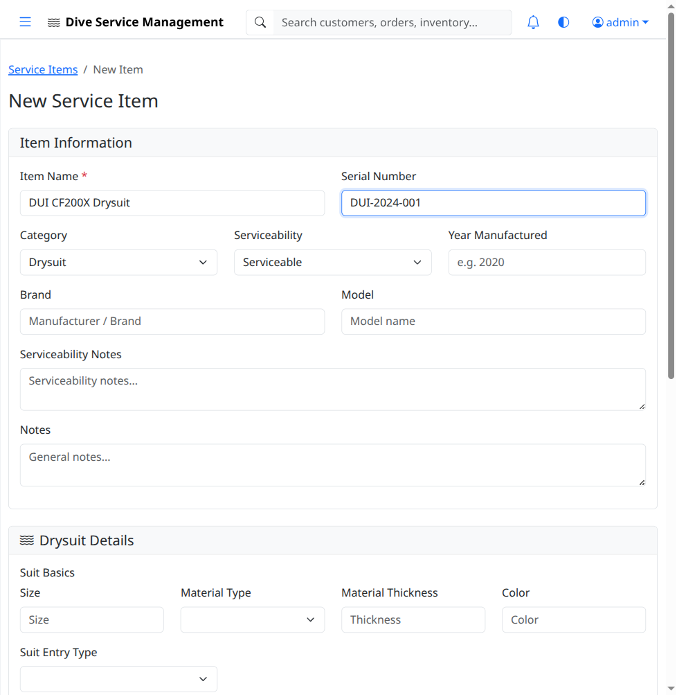
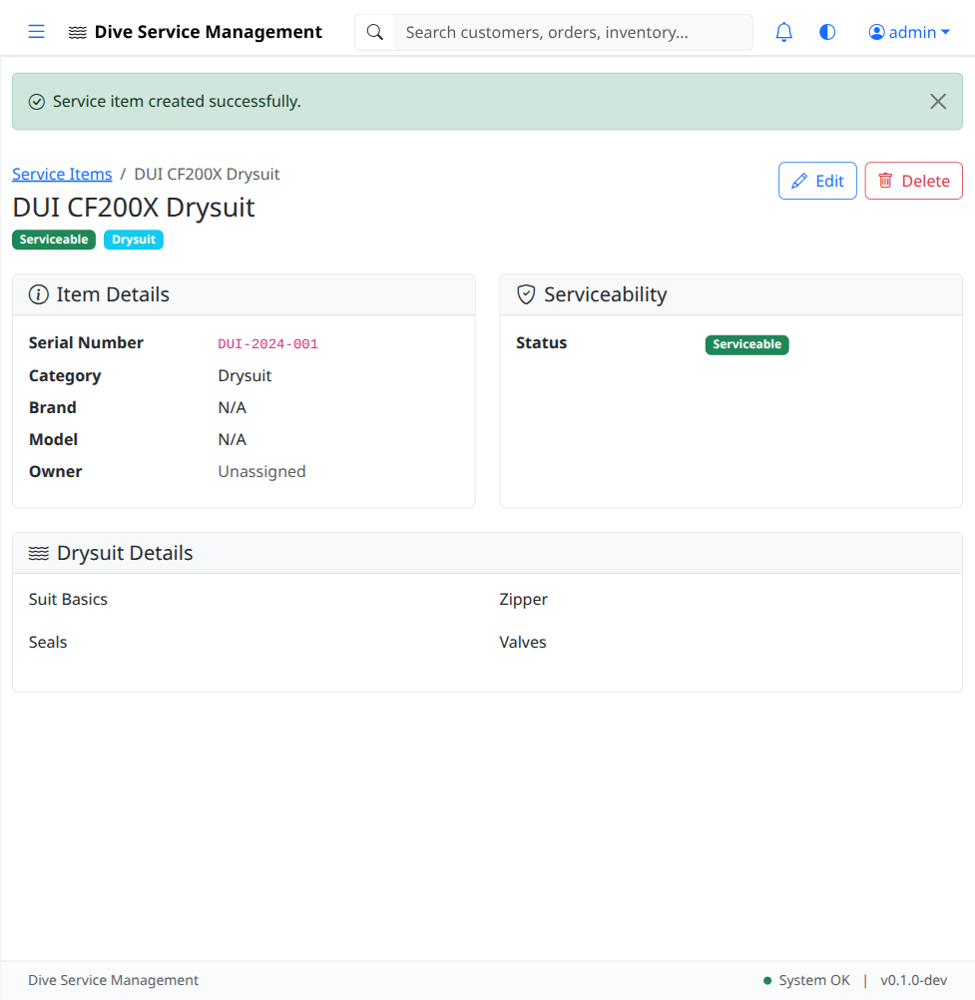

# UAT-03: Service Items

| Field            | Value                                      |
|------------------|--------------------------------------------|
| **UAT Script**   | UAT-03                                     |
| **Feature**      | Service Items (Equipment Tracking)         |
| **Version**      | 1.0                                        |
| **Date Created** | 2026-03-04                                 |
| **Estimated Time** | 20 minutes                               |
| **Prerequisites** | UAT-01 completed (authentication works); UAT-02 completed (at least one customer "John Diver" exists); Application running at http://localhost:8080 |
| **Test Account** | admin@example.com / admin123               |

---

## Objective

Verify that service items (customer equipment) can be created, viewed, edited, and associated with customers. Verify that drysuit-specific fields appear when the "Drysuit" category is selected. Verify the item lookup feature works.

---

## Test Steps

### TC-03.1: Navigate to Service Items

1. Log in as **admin@example.com** / **admin123**.
2. Navigate to the items page by either:
   - Clicking a "Service Items" or "Items" link in the sidebar (if available), OR
   - Directly navigating to **http://localhost:8080/items/**
3. Verify the items list page loads.
4. Verify an **"Add Item"** button is visible.

- [ ] **Step passed** -- Service items list page loads
- [ ] **Step passed** -- "Add Item" button is visible

---

### TC-03.2: Open Item Form

1. Click the **"Add Item"** button.
2. Verify the item creation form loads.
3. Verify the form contains fields for:
   - **Name** (item/equipment name)
   - **Serial Number**
   - **Category** (dropdown with options such as Drysuit, BCD, Regulator, etc.)
   - **Customer** (dropdown or search to associate with a customer)
   - Additional fields as appropriate (brand, model, notes, etc.)

- [ ] **Step passed** -- Item form loads with all expected fields

---

### TC-03.3: Create a Drysuit Service Item

1. Fill in the form with the following data:
   - **Name:** `DUI CF200X Drysuit`
   - **Serial Number:** `DUI-2024-001`
   - **Category:** `Drysuit`
   - **Customer:** `John Diver` (select from dropdown)

2. If the category "Drysuit" triggers additional fields (brand, model, seal types, etc.), verify they appear and fill them in as appropriate.
3. Click **"Save"** (or equivalent submit button).
4. Verify a success message appears.
5. Verify you are redirected to the **item detail page** showing all entered information.

- [ ] **Step passed** -- Drysuit category triggers additional drysuit-specific fields
- [ ] **Step passed** -- Item saves successfully with all fields
- [ ] **Step passed** -- Item detail page displays correct information

---

### TC-03.4: Verify Drysuit-Specific Fields

1. On the item detail page for "DUI CF200X Drysuit", verify that drysuit-specific information is displayed, such as:
   - Brand
   - Model
   - Seal types (neck seal type, wrist seal type)
   - Zipper type
   - Any other drysuit-relevant fields
2. If these fields were filled in during creation, verify they show the correct values.

- [ ] **Step passed** -- Drysuit-specific fields are displayed on the detail page

---

### TC-03.5: Verify Item in List

1. Navigate back to the items list (**http://localhost:8080/items/**).
2. Verify that **"DUI CF200X Drysuit"** appears in the list.
3. Verify the serial number **"DUI-2024-001"** is visible in the list row.

- [ ] **Step passed** -- New item appears in the items list with correct serial number

---

### TC-03.6: Search by Serial Number

1. On the items list page, locate the search bar or filter.
2. Enter `DUI-2024-001` and search.
3. Verify the search results include **"DUI CF200X Drysuit"**.

- [ ] **Step passed** -- Serial number search returns the correct item

---

### TC-03.7: Edit Item

1. Click on the item **"DUI CF200X Drysuit"** to view its detail page.
2. Click the **"Edit"** button.
3. Verify the edit form loads pre-populated with the item's current data.
4. Change the **Name** to `DUI CF200X Drysuit (Updated)`.
5. Click **"Save"**.
6. Verify the detail page reflects the updated name.

- [ ] **Step passed** -- Edit form pre-populates with existing data
- [ ] **Step passed** -- Name change is saved and displayed correctly

---

### TC-03.8: Item Lookup Feature

1. Navigate to the item lookup page at **http://localhost:8080/items/lookup**.
2. Verify the lookup page loads.
3. Enter the serial number `DUI-2024-001` in the lookup field.
4. Submit the lookup.
5. Verify the system returns the correct item: **"DUI CF200X Drysuit (Updated)"**.

- [ ] **Step passed** -- Item lookup page loads
- [ ] **Step passed** -- Lookup by serial number returns the correct item

---

### TC-03.9: Customer Association

1. Navigate to the **Customers** page and click on **"John Diver"**.
2. On the customer detail page, verify that the item **"DUI CF200X Drysuit (Updated)"** appears in the customer's associated items section.

- [ ] **Step passed** -- Item is associated with the correct customer on their detail page

---

### TC-03.10: Create Non-Drysuit Item

1. Navigate to items and click **"Add Item"**.
2. Fill in:
   - **Name:** `Scubapro MK25/S600 Regulator`
   - **Serial Number:** `SP-REG-2024-001`
   - **Category:** Select a non-drysuit category (e.g., `Regulator`)
   - **Customer:** `John Diver`
3. Verify that drysuit-specific fields do **NOT** appear for this category.
4. Click **"Save"**.
5. Verify the item is created successfully.

- [ ] **Step passed** -- Non-drysuit category does not show drysuit-specific fields
- [ ] **Step passed** -- Non-drysuit item saves successfully

---

## Test Summary

| Test Case | Description                        | Pass | Fail | Notes |
|-----------|------------------------------------|------|------|-------|
| TC-03.1   | Navigate to service items          |      |      |       |
| TC-03.2   | Open item form                     |      |      |       |
| TC-03.3   | Create a drysuit service item      |      |      |       |
| TC-03.4   | Verify drysuit-specific fields     |      |      |       |
| TC-03.5   | Verify item in list                |      |      |       |
| TC-03.6   | Search by serial number            |      |      |       |
| TC-03.7   | Edit item                          |      |      |       |
| TC-03.8   | Item lookup feature                |      |      |       |
| TC-03.9   | Customer association               |      |      |       |
| TC-03.10  | Create non-drysuit item            |      |      |       |

---

## Notes

_Space for tester comments, observations, and issues encountered:_

    

---

**Tester Name:** ____________________
**Date Tested:** ____________________
**Overall Result:** PASS / FAIL
