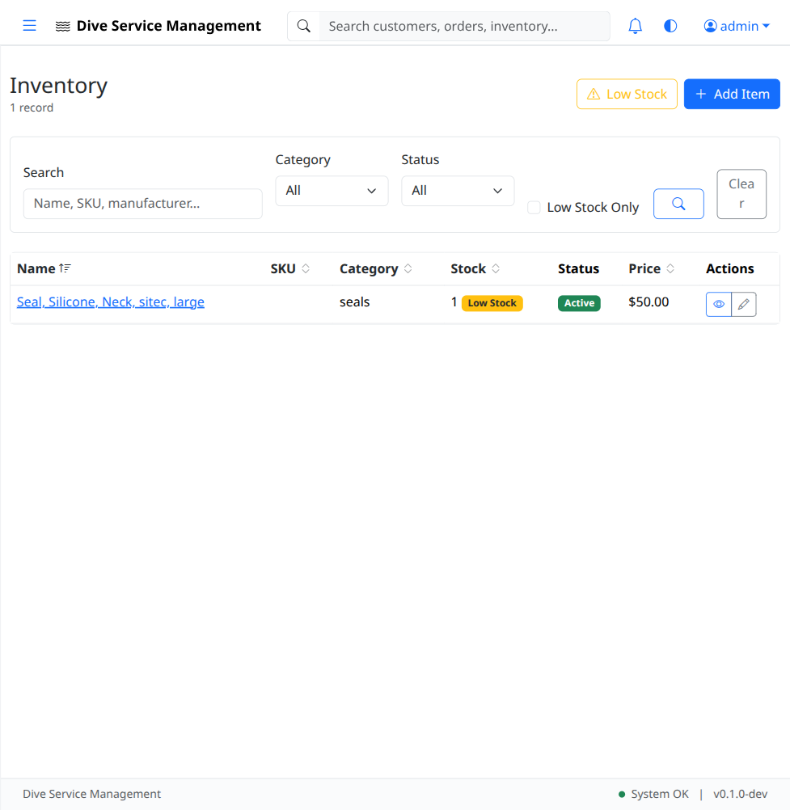
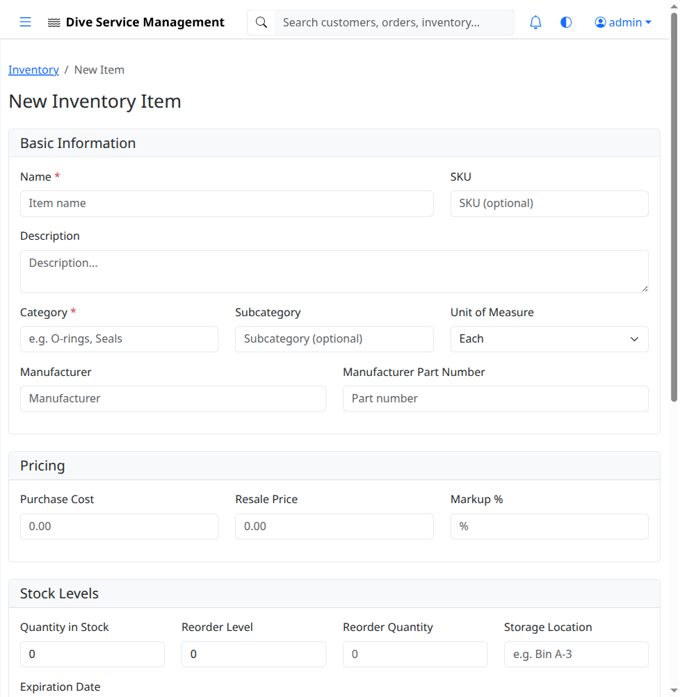
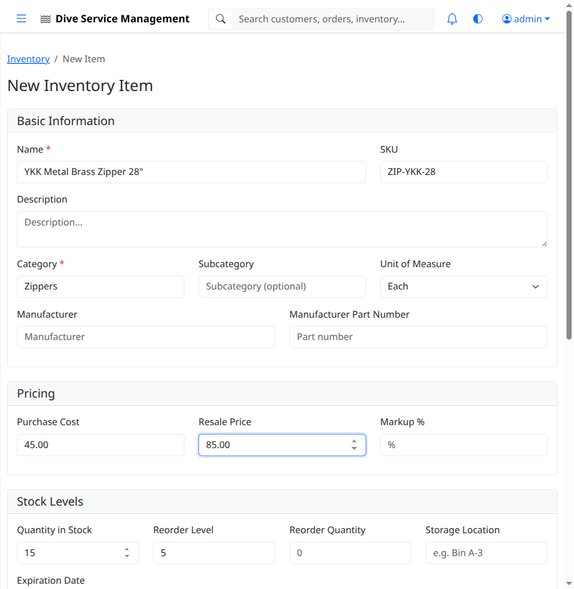
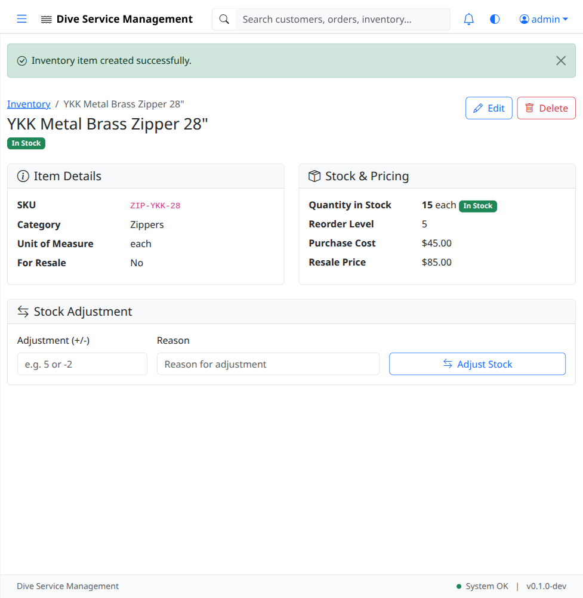

# UAT-04: Inventory Management

| Field            | Value                                      |
|------------------|--------------------------------------------|
| **UAT Script**   | UAT-04                                     |
| **Feature**      | Inventory Management                       |
| **Version**      | 1.0                                        |
| **Date Created** | 2026-03-04                                 |
| **Estimated Time** | 20 minutes                               |
| **Prerequisites** | UAT-01 completed (authentication works); Application running at http://localhost:8080 |
| **Test Account** | admin@example.com / admin123               |

---

## Objective

Verify that inventory items (parts and supplies) can be created, viewed, edited, and tracked. Verify stock levels display correctly, the low-stock page identifies items below reorder level, and stock adjustments work properly.

---

## Test Steps

### TC-04.1: Navigate to Inventory List

1. Log in as **admin@example.com** / **admin123**.
2. Click **Inventory** in the left sidebar.
3. Verify the inventory list page loads.
4. Verify the page displays a table or list of inventory items (may include seeded items or be empty).
5. Verify an **"Add Item"** button is visible.

- [ ] **Step passed** -- Inventory list page loads
- [ ] **Step passed** -- "Add Item" button is visible

---

### TC-04.2: Open Inventory Form

1. Click the **"Add Item"** button.
2. Verify the inventory item creation form loads.
3. Verify the form contains fields for:
   - **Name**
   - **SKU** (Stock Keeping Unit)
   - **Category** (dropdown)
   - **Quantity** (current stock)
   - **Reorder Level** (minimum stock threshold)
   - **Purchase Cost** (per unit)
   - **Resale Price** (per unit)
   - Additional fields as applicable (description, supplier, etc.)

- [ ] **Step passed** -- Inventory form loads with all expected fields

---

### TC-04.3: Create New Inventory Item

1. Fill in the form with the following data:
   - **Name:** `YKK Metal Brass Zipper 28"`
   - **SKU:** `ZIP-YKK-28`
   - **Category:** `Zippers`
   - **Quantity:** `15`
   - **Reorder Level:** `5`
   - **Purchase Cost:** `$45.00`
   - **Resale Price:** `$85.00`

2. Click **"Save"** (or equivalent submit button).
3. Verify a success flash message appears.
4. Verify you are redirected to the **inventory item detail page** showing the newly created item's information.

- [ ] **Step passed** -- Form accepts all entered data
- [ ] **Step passed** -- Success message appears after save
- [ ] **Step passed** -- Item detail page displays correct information (name, SKU, category, quantity, costs)

---

### TC-04.4: Verify Item in Inventory List

1. Navigate back to the **Inventory** list (click Inventory in sidebar).
2. Verify that **"YKK Metal Brass Zipper 28""** appears in the inventory list.
3. Verify the stock level **15** is displayed in the list row.
4. Verify the SKU **"ZIP-YKK-28"** is visible.

- [ ] **Step passed** -- New inventory item appears in the list with correct stock level

---

### TC-04.5: View Item Detail

1. Click on **"YKK Metal Brass Zipper 28""** in the inventory list.
2. Verify the item detail page loads with all fields:
   - Name: YKK Metal Brass Zipper 28"
   - SKU: ZIP-YKK-28
   - Category: Zippers
   - Quantity: 15
   - Reorder Level: 5
   - Purchase Cost: $45.00
   - Resale Price: $85.00

- [ ] **Step passed** -- Item detail page shows all correct information

---

### TC-04.6: Low Stock Page

1. Navigate to the **Low Stock** page by either:
   - Clicking a "Low Stock" link in the sidebar or inventory page, OR
   - Navigating directly to **http://localhost:8080/inventory/low-stock**
2. Verify the low stock page loads.
3. Verify only items with stock levels **at or below their reorder level** are shown.
4. Verify the **"YKK Metal Brass Zipper 28""** item (quantity 15, reorder level 5) does **NOT** appear on the low stock page (since 15 > 5).

- [ ] **Step passed** -- Low stock page loads
- [ ] **Step passed** -- Only items below reorder level are shown
- [ ] **Step passed** -- Items above reorder level are correctly excluded

---

### TC-04.7: Stock Adjustment - Decrease

1. Navigate to the detail page for **"YKK Metal Brass Zipper 28""**.
2. Look for a stock adjustment feature (button, form, or section).
3. Adjust the stock **down** by 12 units (so the new quantity should be 3).
4. Verify the quantity updates to **3** on the detail page.

- [ ] **Step passed** -- Stock adjustment (decrease) works correctly
- [ ] **Step passed** -- Quantity updates to reflect the adjustment

---

### TC-04.8: Verify Low Stock After Adjustment

1. Navigate to the **Low Stock** page (**http://localhost:8080/inventory/low-stock**).
2. Verify that **"YKK Metal Brass Zipper 28""** now appears in the low stock list (quantity 3 is below reorder level 5).

- [ ] **Step passed** -- Item now appears on low stock page after stock decreased below reorder level

---

### TC-04.9: Stock Adjustment - Increase

1. Navigate back to the detail page for **"YKK Metal Brass Zipper 28""**.
2. Adjust the stock **up** by 20 units (new quantity should be 23).
3. Verify the quantity updates to **23** on the detail page.
4. Navigate to the **Low Stock** page.
5. Verify the item no longer appears in the low stock list.

- [ ] **Step passed** -- Stock adjustment (increase) works correctly
- [ ] **Step passed** -- Item removed from low stock page after restocking

---

### TC-04.10: Edit Inventory Item

1. On the detail page for **"YKK Metal Brass Zipper 28""**, click **"Edit"**.
2. Verify the edit form loads pre-populated with the item's current data.
3. Change the **Resale Price** to `$95.00`.
4. Click **"Save"**.
5. Verify the detail page now shows the updated resale price: **$95.00**.

- [ ] **Step passed** -- Edit form pre-populates with existing data
- [ ] **Step passed** -- Price change is saved and displayed correctly

---

### TC-04.11: Create Low-Stock Item for Verification

1. Create another inventory item:
   - **Name:** `Silicon Neck Seal - Standard`
   - **SKU:** `SEAL-NECK-STD`
   - **Category:** `Seals`
   - **Quantity:** `2`
   - **Reorder Level:** `10`
   - **Purchase Cost:** `$8.00`
   - **Resale Price:** `$25.00`
2. Click **"Save"**.
3. Navigate to the **Low Stock** page.
4. Verify this new item appears (quantity 2 < reorder level 10).

- [ ] **Step passed** -- Second inventory item created
- [ ] **Step passed** -- Low-stock item correctly appears on the low stock page

---

## Test Summary

| Test Case | Description                          | Pass | Fail | Notes |
|-----------|--------------------------------------|------|------|-------|
| TC-04.1   | Navigate to inventory list           |      |      |       |
| TC-04.2   | Open inventory form                  |      |      |       |
| TC-04.3   | Create new inventory item            |      |      |       |
| TC-04.4   | Verify item in inventory list        |      |      |       |
| TC-04.5   | View item detail                     |      |      |       |
| TC-04.6   | Low stock page                       |      |      |       |
| TC-04.7   | Stock adjustment - decrease          |      |      |       |
| TC-04.8   | Verify low stock after adjustment    |      |      |       |
| TC-04.9   | Stock adjustment - increase          |      |      |       |
| TC-04.10  | Edit inventory item                  |      |      |       |
| TC-04.11  | Create low-stock item for verification |    |      |       |

---

## Notes

_Space for tester comments, observations, and issues encountered:_

    

---

**Tester Name:** ____________________
**Date Tested:** ____________________
**Overall Result:** PASS / FAIL
