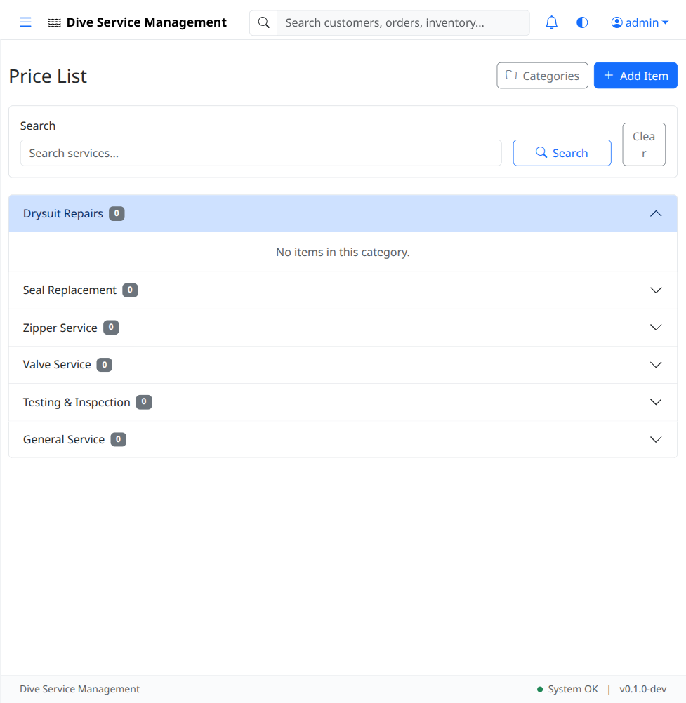
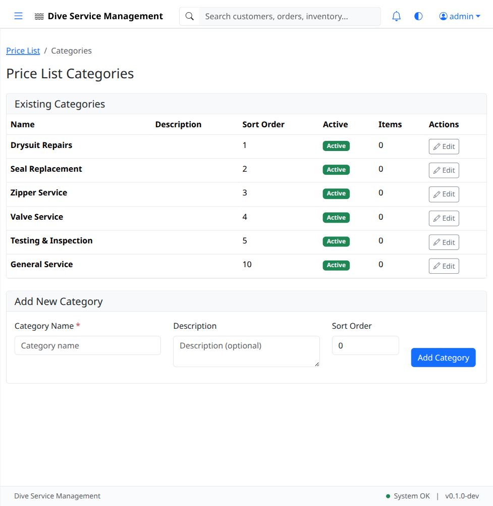
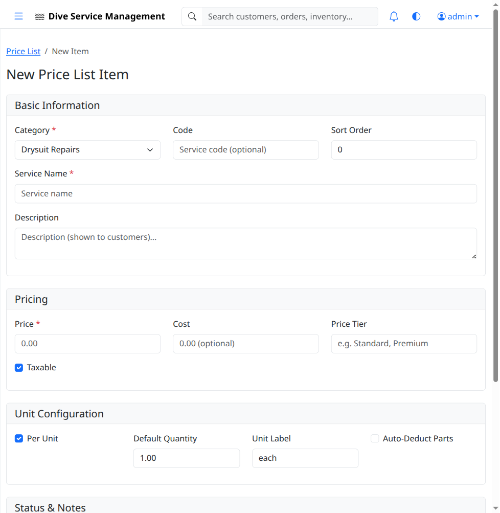

# UAT-05: Price List

| Field            | Value                                      |
|------------------|--------------------------------------------|
| **UAT Script**   | UAT-05                                     |
| **Feature**      | Price List Management                      |
| **Version**      | 1.0                                        |
| **Date Created** | 2026-03-04                                 |
| **Estimated Time** | 15 minutes                               |
| **Prerequisites** | UAT-01 completed (authentication works); Application running at http://localhost:8080 |
| **Test Account** | admin@example.com / admin123               |

---

## Objective

Verify that the price list displays service categories and items, that new price list items can be created with correct category association, and that the duplicate feature works to create variants of existing items.

---

## Test Steps

### TC-05.1: Navigate to Price List

1. Log in as **admin@example.com** / **admin123**.
2. Click **Price List** in the left sidebar.
3. Verify the price list page loads.
4. Verify the page displays a list or table of priced service items.
5. Verify an **"Add Item"** button is visible.

- [ ] **Step passed** -- Price list page loads
- [ ] **Step passed** -- "Add Item" button is visible

---

### TC-05.2: Verify Seeded Categories

1. Navigate to **http://localhost:8080/price-list/categories**.
2. Verify the categories page loads.
3. Verify the following **6 seeded categories** are present:
   - Drysuit Repairs
   - Seal Replacement
   - Zipper Service
   - Valve Service
   - Testing & Inspection
   - General Service

- [ ] **Step passed** -- Categories page loads
- [ ] **Step passed** -- All 6 seeded categories are present

---

### TC-05.3: Open Price List Item Form

1. Navigate back to the **Price List** page.
2. Click the **"Add Item"** button.
3. Verify the price list item form loads.
4. Verify the form contains fields for:
   - **Name** (service name)
   - **Category** (dropdown populated with the seeded categories)
   - **Price** (dollar amount)
   - **Code** (unique item code)
   - Additional fields as applicable (description, duration, etc.)

- [ ] **Step passed** -- Price list item form loads
- [ ] **Step passed** -- Category dropdown is populated with seeded categories

---

### TC-05.4: Create New Price List Item

1. Fill in the form with the following data:
   - **Name:** `Zipper Replacement - Full`
   - **Category:** `Zipper Service` (select from dropdown)
   - **Price:** `$350.00`
   - **Code:** `ZR-FULL`
2. Click **"Save"** (or equivalent submit button).
3. Verify a success flash message appears.
4. Verify you are redirected to the price list item detail page or back to the price list.

- [ ] **Step passed** -- Form accepts all entered data
- [ ] **Step passed** -- Success message appears after save

---

### TC-05.5: Verify Item in Price List

1. Navigate to the **Price List** page.
2. Verify that **"Zipper Replacement - Full"** appears in the list.
3. Verify the price **$350.00** is displayed.
4. Verify the category **"Zipper Service"** is displayed.
5. Verify the code **"ZR-FULL"** is displayed.

- [ ] **Step passed** -- New item appears in the price list with correct details

---

### TC-05.6: View Price List Item Detail

1. Click on **"Zipper Replacement - Full"** in the price list.
2. Verify the detail page loads showing:
   - Name: Zipper Replacement - Full
   - Category: Zipper Service
   - Price: $350.00
   - Code: ZR-FULL

- [ ] **Step passed** -- Item detail page shows all correct information

---

### TC-05.7: Duplicate Price List Item

1. On the detail page (or from the list), locate the **"Duplicate"** action (button or link).
2. Click **Duplicate**.
3. Verify a new form or duplicate item is created pre-populated with the original item's data.
4. Modify the duplicated item:
   - **Name:** `Zipper Replacement - Partial`
   - **Price:** `$200.00`
   - **Code:** `ZR-PARTIAL`
5. Click **"Save"**.
6. Verify the new variant appears in the price list alongside the original.

- [ ] **Step passed** -- Duplicate action creates a pre-populated copy
- [ ] **Step passed** -- Modified duplicate saves as a new item
- [ ] **Step passed** -- Both original and duplicate appear in the price list

---

### TC-05.8: Edit Price List Item

1. Click on **"Zipper Replacement - Full"** in the price list.
2. Click **"Edit"**.
3. Change the **Price** to `$375.00`.
4. Click **"Save"**.
5. Verify the updated price **$375.00** appears on the detail page and in the price list.

- [ ] **Step passed** -- Edit form pre-populates correctly
- [ ] **Step passed** -- Price change is saved and displayed

---

### TC-05.9: Filter by Category

1. On the price list page, if a category filter is available, select **"Zipper Service"**.
2. Verify only items in the Zipper Service category are displayed.
3. Verify both "Zipper Replacement - Full" and "Zipper Replacement - Partial" appear.
4. Clear the filter and verify the full list returns.

- [ ] **Step passed** -- Category filter works correctly (or note if not available)

---

## Test Summary

| Test Case | Description                        | Pass | Fail | Notes |
|-----------|------------------------------------|------|------|-------|
| TC-05.1   | Navigate to price list             |      |      |       |
| TC-05.2   | Verify seeded categories           |      |      |       |
| TC-05.3   | Open price list item form          |      |      |       |
| TC-05.4   | Create new price list item         |      |      |       |
| TC-05.5   | Verify item in price list          |      |      |       |
| TC-05.6   | View price list item detail        |      |      |       |
| TC-05.7   | Duplicate price list item          |      |      |       |
| TC-05.8   | Edit price list item               |      |      |       |
| TC-05.9   | Filter by category                 |      |      |       |

---

## Notes

_Space for tester comments, observations, and issues encountered:_

    

---

**Tester Name:** ____________________
**Date Tested:** ____________________
**Overall Result:** PASS / FAIL
