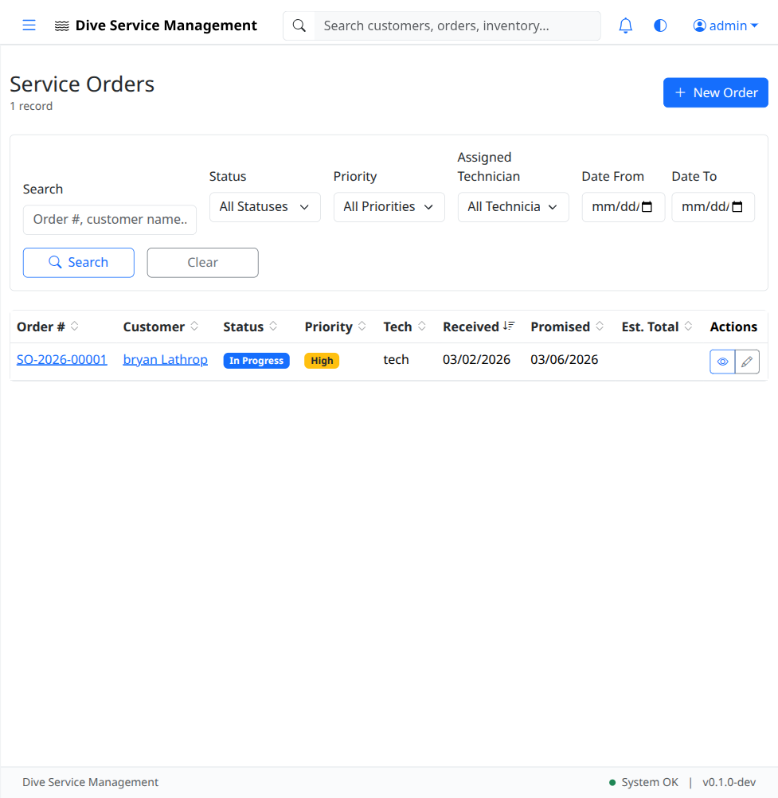
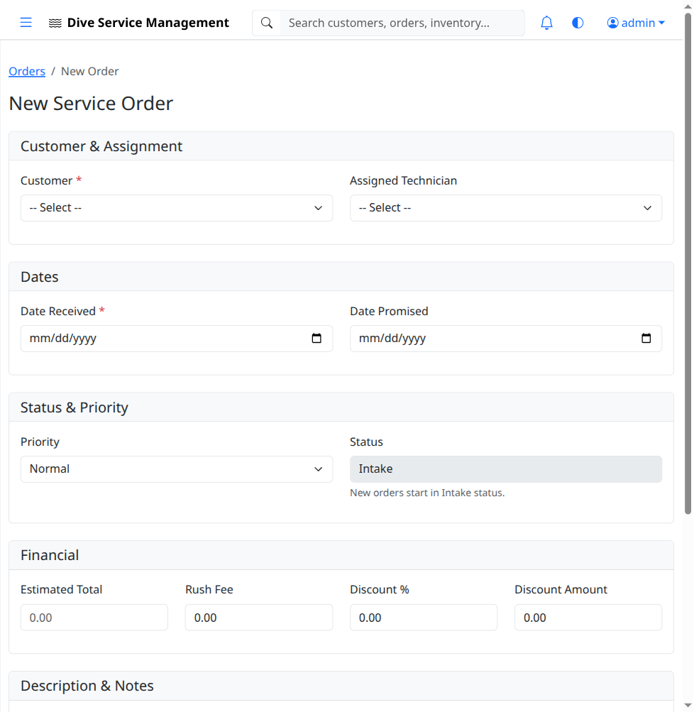
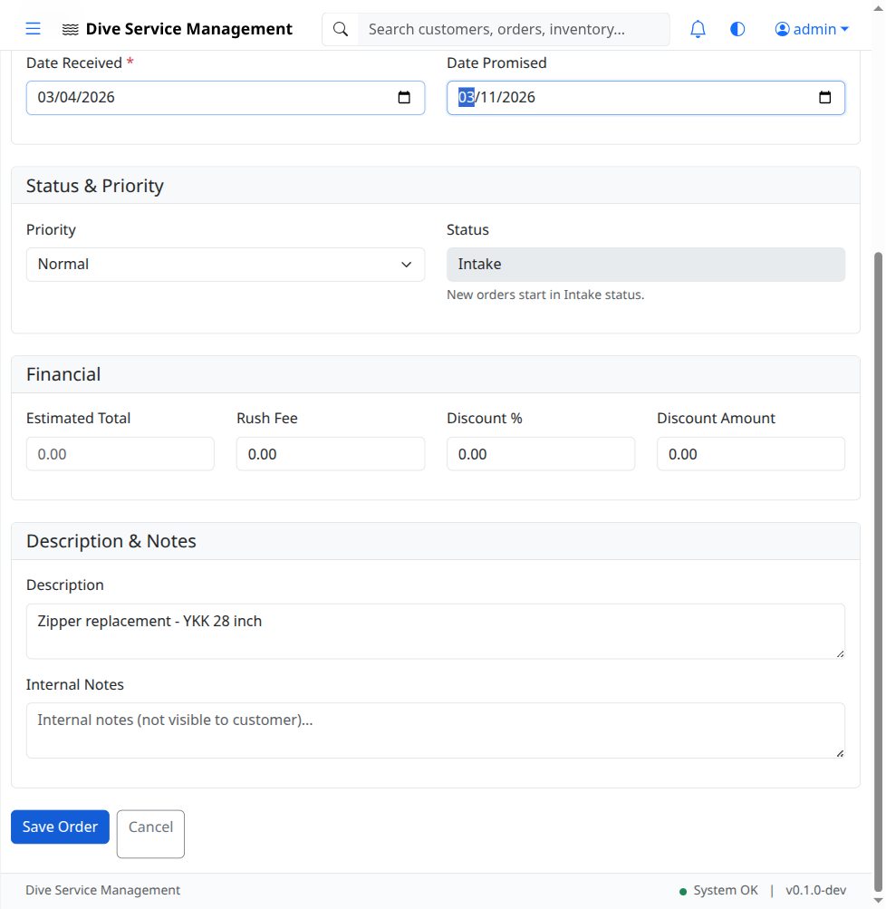
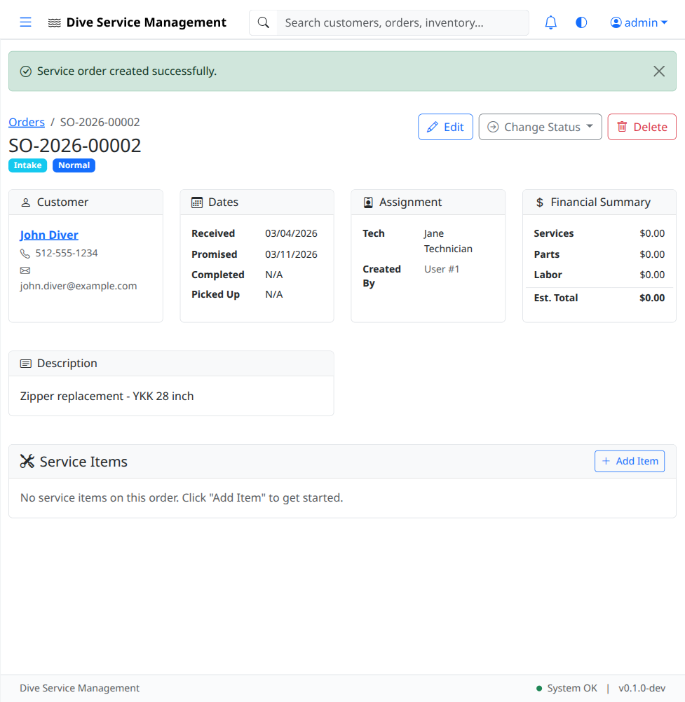
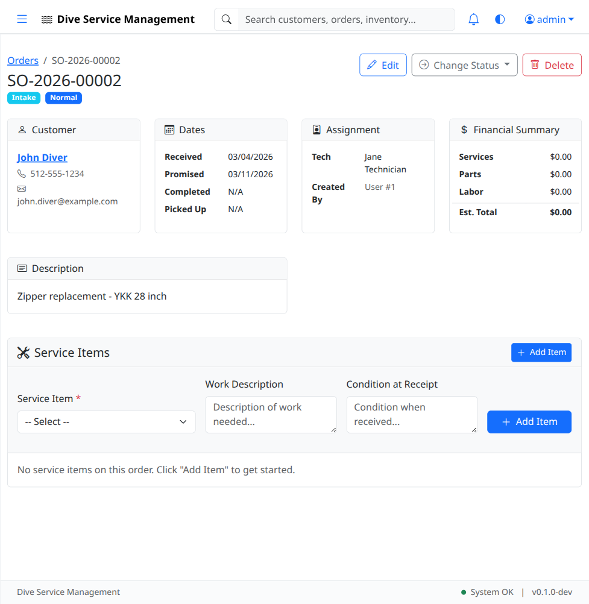

# UAT-06: Service Orders

| Field            | Value                                      |
|------------------|--------------------------------------------|
| **UAT Script**   | UAT-06                                     |
| **Feature**      | Service Order Management                   |
| **Version**      | 1.0                                        |
| **Date Created** | 2026-03-04                                 |
| **Estimated Time** | 25 minutes                               |
| **Prerequisites** | UAT-01 completed (authentication works); UAT-02 completed (customer "John Diver" exists); UAT-03 completed (at least one service item exists); Application running at http://localhost:8080 |
| **Test Account** | admin@example.com / admin123               |

---

## Objective

Verify that service orders can be created, viewed, and managed through their full lifecycle. Verify that service items can be added to orders, status transitions work correctly, and notes can be added. Verify order numbering follows the SO-YYYY-XXXXX pattern.

---

## Test Steps

### TC-06.1: Navigate to Orders List

1. Log in as **admin@example.com** / **admin123**.
2. Click **Orders** in the left sidebar.
3. Verify the orders list page loads.
4. Verify the page displays a table or list of orders (may be empty in a fresh database).
5. Verify a **"New Order"** button is visible.

- [ ] **Step passed** -- Orders list page loads
- [ ] **Step passed** -- "New Order" button is visible

---

### TC-06.2: Open New Order Form

1. Click the **"New Order"** button.
2. Verify the order creation form loads.
3. Verify the form contains fields for:
   - **Customer** (dropdown or search)
   - **Date Received** (date picker)
   - **Date Promised** (date picker)
   - **Technician** (dropdown, e.g., "Jane Technician")
   - **Description** (text area for work description)
   - **Priority** (dropdown: Low, Normal, High, Urgent)

- [ ] **Step passed** -- Order form loads with all expected fields

---

### TC-06.3: Create New Service Order

1. Fill in the form with the following data:
   - **Customer:** `John Diver` (select from dropdown)
   - **Date Received:** Today's date
   - **Date Promised:** 7 days from today
   - **Technician:** `Jane Technician` (or available tech from dropdown)
   - **Description:** `Zipper replacement`
   - **Priority:** `Normal`

2. Click **"Save Order"** (or equivalent submit button).
3. Verify a success flash message appears.
4. Verify you are redirected to the **order detail page**.
5. Verify the order has an order number following the pattern **SO-2026-XXXXX** (e.g., SO-2026-00001).

- [ ] **Step passed** -- Order saves successfully
- [ ] **Step passed** -- Order detail page displays correct customer, dates, tech, description, priority
- [ ] **Step passed** -- Order number follows SO-YYYY-XXXXX pattern

---

### TC-06.4: Add Service Item to Order

1. On the order detail page, locate the service items section.
2. Click **"+ Add Item"** to expand the service item form.

3. Select a service item from the dropdown (e.g., "DUI CF200X Drysuit" if created in UAT-03).
4. Fill in the work description field (e.g., "Replace main zipper - YKK brass 28 inch").
5. Click **"Add Item"** (or equivalent button).
6. Verify the item appears in the order's service items list.
7. Verify the item details are correct (item name, work description).

- [ ] **Step passed** -- "Add Item" form expands/appears
- [ ] **Step passed** -- Service item can be selected from dropdown
- [ ] **Step passed** -- Item appears in order after adding

---

### TC-06.5: Verify Order in Orders List

1. Navigate back to the **Orders** list (click Orders in sidebar).
2. Verify the newly created order appears in the list.
3. Verify the list shows:
   - Order number (SO-2026-XXXXX)
   - Customer name (John Diver)
   - Status (initial status, e.g., "Received" or "New")
   - Priority (Normal)

- [ ] **Step passed** -- New order appears in the orders list with correct details

---

### TC-06.6: Status Transition - Received to Assessment

1. Navigate to the order detail page for the order created in TC-06.3.
2. Locate the **Status** section (dropdown, button, or workflow control).
3. Change the status from the initial status to **"Assessment"**.
4. Verify the status badge or indicator updates to **"Assessment"**.
5. Verify any status change is logged (check for a status history or activity log section).

- [ ] **Step passed** -- Status can be changed to "Assessment"
- [ ] **Step passed** -- Status badge updates to reflect new status

---

### TC-06.7: Status Transition - Assessment to In Progress

1. On the same order detail page, change the status to **"In Progress"**.
2. Verify the status badge updates to **"In Progress"**.

- [ ] **Step passed** -- Status transitions to "In Progress"

---

### TC-06.8: Status Transition - In Progress to Complete

1. On the same order detail page, change the status to **"Complete"** (or "Completed").
2. Verify the status badge updates accordingly.

- [ ] **Step passed** -- Status transitions to "Complete"

---

### TC-06.9: Add Notes to Order

1. Navigate to the order detail page (create a new order or use the existing one).
2. Scroll to the **Notes** section at the bottom of the page.
3. Enter a note: `Customer called to check on status. Zipper parts arrived, installation scheduled for tomorrow.`
4. Click the **"Add Note"** button (or equivalent).
5. Verify the note appears in the notes section with:
   - The note text
   - The author (admin)
   - A timestamp

- [ ] **Step passed** -- Note can be entered and saved
- [ ] **Step passed** -- Note displays with author and timestamp

---

### TC-06.10: Add Second Note

1. Add another note: `Zipper installation complete. Testing seal integrity.`
2. Click **"Add Note"**.
3. Verify both notes are displayed in chronological order.

- [ ] **Step passed** -- Multiple notes can be added
- [ ] **Step passed** -- Notes display in chronological order

---

### TC-06.11: Order Detail - Complete View

1. On the order detail page, verify the following sections are present and populated:
   - **Order header** -- order number, status, priority, dates
   - **Customer information** -- name, contact details
   - **Technician assignment**
   - **Service items** -- list of items being serviced
   - **Work description**
   - **Notes** -- all added notes

- [ ] **Step passed** -- Order detail page displays all sections with correct data

---

### TC-06.12: Create a Second Order

1. Navigate to Orders and click **"New Order"**.
2. Create an order with different details:
   - **Customer:** `John Diver`
   - **Description:** `Annual inspection and pressure test`
   - **Priority:** `High`
3. Save the order.
4. Verify the order number increments (e.g., SO-2026-00002).
5. Navigate to the orders list and verify both orders appear.

- [ ] **Step passed** -- Second order creates with incremented order number
- [ ] **Step passed** -- Both orders appear in the list

---

## Test Summary

| Test Case | Description                           | Pass | Fail | Notes |
|-----------|---------------------------------------|------|------|-------|
| TC-06.1   | Navigate to orders list               |      |      |       |
| TC-06.2   | Open new order form                   |      |      |       |
| TC-06.3   | Create new service order              |      |      |       |
| TC-06.4   | Add service item to order             |      |      |       |
| TC-06.5   | Verify order in orders list           |      |      |       |
| TC-06.6   | Status: Received to Assessment        |      |      |       |
| TC-06.7   | Status: Assessment to In Progress     |      |      |       |
| TC-06.8   | Status: In Progress to Complete       |      |      |       |
| TC-06.9   | Add notes to order                    |      |      |       |
| TC-06.10  | Add second note                       |      |      |       |
| TC-06.11  | Order detail - complete view          |      |      |       |
| TC-06.12  | Create a second order                 |      |      |       |

---

## Notes

_Space for tester comments, observations, and issues encountered:_

    

---

**Tester Name:** ____________________
**Date Tested:** ____________________
**Overall Result:** PASS / FAIL
