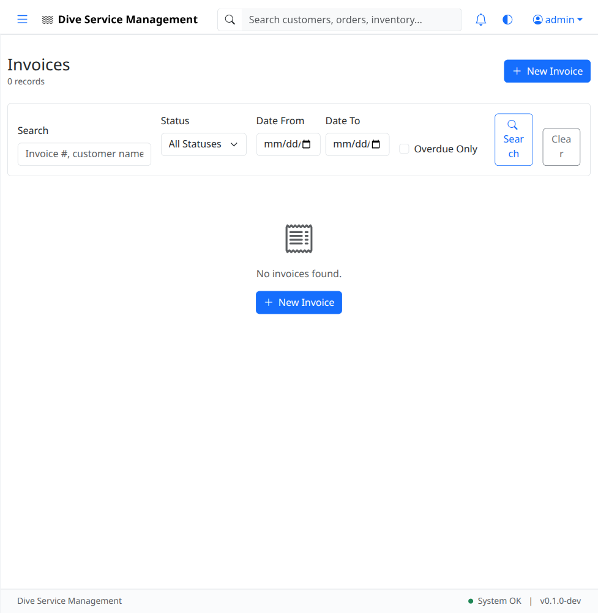

# UAT-07: Invoices & Billing

| Field            | Value                                      |
|------------------|--------------------------------------------|
| **UAT Script**   | UAT-07                                     |
| **Feature**      | Invoices & Billing                         |
| **Version**      | 1.0                                        |
| **Date Created** | 2026-03-04                                 |
| **Estimated Time** | 25 minutes                               |
| **Prerequisites** | UAT-01 completed (authentication works); UAT-02 completed (customer "John Diver" exists); UAT-06 completed (at least one completed service order exists); Application running at http://localhost:8080 |
| **Test Account** | admin@example.com / admin123               |

---

## Objective

Verify that invoices can be created manually, generated from service orders, and managed through the billing lifecycle. Verify line items can be added, payments can be recorded, balance due calculations are correct, and void functionality works for admin users.

---

## Test Steps

### TC-07.1: Navigate to Invoices List

1. Log in as **admin@example.com** / **admin123**.
2. Click **Invoices** in the left sidebar.
3. Verify the invoices list page loads.
4. Verify the page displays a table or list of invoices (may be empty initially).
5. Verify a **"New Invoice"** button is visible.

- [ ] **Step passed** -- Invoices list page loads
- [ ] **Step passed** -- "New Invoice" button is visible

---

### TC-07.2: Create New Invoice

1. Click the **"New Invoice"** button.
2. Verify the invoice creation form loads.
3. Fill in the form:
   - **Customer:** `John Diver` (select from dropdown)
   - **Issue Date:** Today's date
   - **Due Date:** 30 days from today
   - **Tax Rate:** Enter a tax rate (e.g., `8.25` for 8.25%)
4. Click **"Save"** (or equivalent submit button).
5. Verify a success flash message appears.
6. Verify you are redirected to the **invoice detail page**.
7. Verify the invoice has a number following the pattern **INV-2026-XXXXX** (e.g., INV-2026-00001).

- [ ] **Step passed** -- Invoice form loads and accepts data
- [ ] **Step passed** -- Invoice saves successfully
- [ ] **Step passed** -- Invoice number follows INV-YYYY-XXXXX pattern

---

### TC-07.3: Add Line Items

1. On the invoice detail page, locate the line items section.
2. Click **"Add Line Item"** (or equivalent button).
3. Fill in the first line item:
   - **Type:** Service (or select from available types)
   - **Description:** `Zipper Replacement - Full`
   - **Quantity:** `1`
   - **Unit Price:** `$350.00`
4. Click **"Add"** or **"Save Line Item"**.
5. Verify the line item appears in the invoice with:
   - Description: Zipper Replacement - Full
   - Quantity: 1
   - Unit Price: $350.00
   - Line Total: $350.00

- [ ] **Step passed** -- Line item form is available
- [ ] **Step passed** -- First line item added with correct totals

---

### TC-07.4: Add Second Line Item

1. Click **"Add Line Item"** again.
2. Fill in the second line item:
   - **Type:** Parts
   - **Description:** `YKK Metal Brass Zipper 28"`
   - **Quantity:** `1`
   - **Unit Price:** `$85.00`
3. Click **"Add"** or **"Save Line Item"**.
4. Verify both line items appear.
5. Verify the **subtotal** is calculated correctly: $350.00 + $85.00 = **$435.00**.
6. Verify the **tax** is calculated correctly (e.g., $435.00 x 8.25% = **$35.89**).
7. Verify the **total** is correct: $435.00 + $35.89 = **$470.89**.

- [ ] **Step passed** -- Second line item added
- [ ] **Step passed** -- Subtotal calculates correctly
- [ ] **Step passed** -- Tax calculates correctly
- [ ] **Step passed** -- Total (including tax) is correct

---

### TC-07.5: Record a Payment

1. On the invoice detail page, locate the payments section.
2. Fill in the payment form:
   - **Amount:** `$200.00`
   - **Date:** Today's date
   - **Method:** Select a payment method (e.g., Credit Card, Cash, Check)
3. Click **"Record Payment"** (or equivalent button).
4. Verify the payment appears in the payments list.
5. Verify the **Balance Due** updates correctly:
   - Total: $470.89
   - Payment: $200.00
   - **Balance Due: $270.89**

- [ ] **Step passed** -- Payment form is available
- [ ] **Step passed** -- Payment records successfully
- [ ] **Step passed** -- Balance due updates correctly after payment

---

### TC-07.6: Record Second Payment (Full Balance)

1. Record another payment:
   - **Amount:** `$270.89` (remaining balance)
   - **Date:** Today's date
   - **Method:** Cash
2. Click **"Record Payment"**.
3. Verify the payment appears in the payments list.
4. Verify the **Balance Due** is now **$0.00**.
5. Verify the invoice status changes to **"Paid"** (or equivalent status).

- [ ] **Step passed** -- Second payment records successfully
- [ ] **Step passed** -- Balance due is $0.00
- [ ] **Step passed** -- Invoice status reflects fully paid

---

### TC-07.7: Generate Invoice from Service Order

1. Navigate to **Orders** in the sidebar.
2. Click on a completed service order (from UAT-06).
3. On the order detail page, look for a **"Generate Invoice"** or **"Create Invoice"** button.
4. Click it.
5. Verify a new invoice is created pre-populated with:
   - Customer from the order
   - Line items based on the service items and work performed
6. Verify the invoice detail page loads with the generated data.

- [ ] **Step passed** -- "Generate Invoice" button is available on order detail
- [ ] **Step passed** -- Invoice is created with order data pre-populated

---

### TC-07.8: Verify Invoice in List

1. Navigate to the **Invoices** list.
2. Verify both invoices appear:
   - The manually created invoice from TC-07.2
   - The invoice generated from the order in TC-07.7
3. Verify the list shows invoice number, customer, total, status, and dates.

- [ ] **Step passed** -- All invoices appear in the list with correct information

---

### TC-07.9: Void Invoice (Admin Only)

1. While logged in as admin, navigate to an invoice detail page.
2. Look for a **"Void"** or **"Void Invoice"** action.
3. Click **Void**.
4. Confirm the void action if prompted.
5. Verify the invoice status changes to **"Void"**.
6. Verify the voided invoice remains in the list but is clearly marked as void.

- [ ] **Step passed** -- Void action is available for admin
- [ ] **Step passed** -- Invoice status changes to "Void"
- [ ] **Step passed** -- Voided invoice is clearly marked in the list

---

### TC-07.10: Verify Non-Admin Cannot Void

1. Log out of the admin account.
2. Log in as **tech@example.com** / **tech123**.
3. Navigate to an invoice detail page.
4. Verify the **"Void"** action is **NOT available** for the tech role.

- [ ] **Step passed** -- Tech user cannot void invoices

---

## Test Summary

| Test Case | Description                           | Pass | Fail | Notes |
|-----------|---------------------------------------|------|------|-------|
| TC-07.1   | Navigate to invoices list             |      |      |       |
| TC-07.2   | Create new invoice                    |      |      |       |
| TC-07.3   | Add line items                        |      |      |       |
| TC-07.4   | Add second line item                  |      |      |       |
| TC-07.5   | Record a payment                      |      |      |       |
| TC-07.6   | Record second payment (full balance)  |      |      |       |
| TC-07.7   | Generate invoice from service order   |      |      |       |
| TC-07.8   | Verify invoice in list                |      |      |       |
| TC-07.9   | Void invoice (admin only)             |      |      |       |
| TC-07.10  | Verify non-admin cannot void          |      |      |       |

---

## Notes

_Space for tester comments, observations, and issues encountered:_

    

---

**Tester Name:** ____________________
**Date Tested:** ____________________
**Overall Result:** PASS / FAIL
