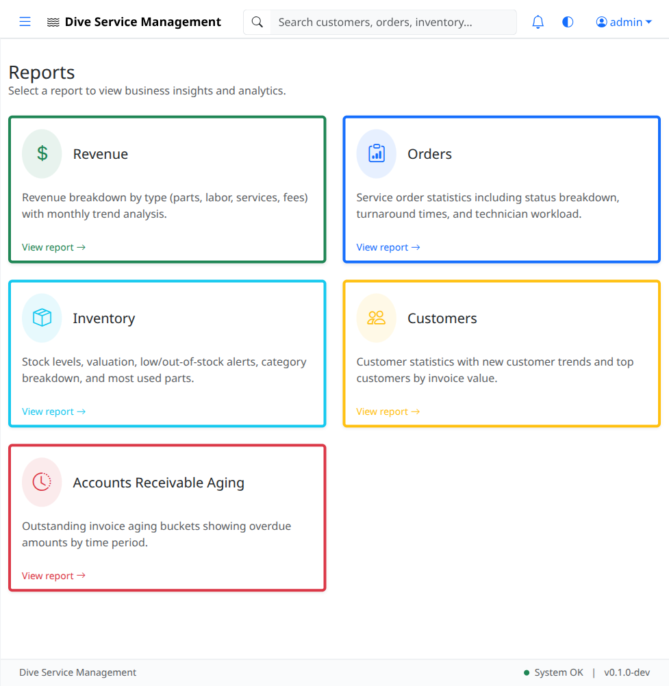
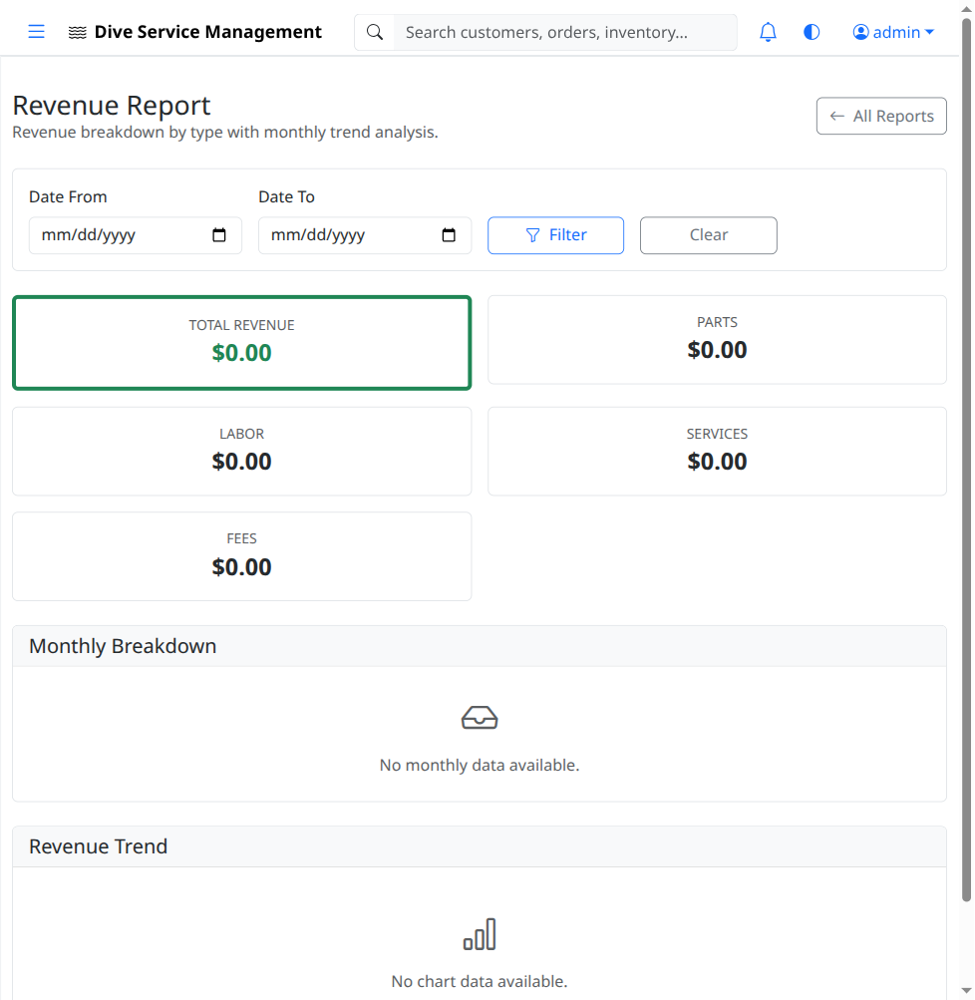

# UAT-08: Reports

| Field            | Value                                      |
|------------------|--------------------------------------------|
| **UAT Script**   | UAT-08                                     |
| **Feature**      | Reports & Analytics                        |
| **Version**      | 1.0                                        |
| **Date Created** | 2026-03-04                                 |
| **Estimated Time** | 20 minutes                               |
| **Prerequisites** | UAT-01 completed (authentication works); Recommended: UAT-02 through UAT-07 completed (so reports have data to display); Application running at http://localhost:8080 |
| **Test Account** | admin@example.com / admin123 (primary), viewer@example.com / viewer123 (access verification) |

---

## Objective

Verify that the Reports hub displays all available report types, that each individual report loads correctly with appropriate data visualizations, and that date range filtering works. Verify that the viewer role can access reports.

---

## Test Steps

### TC-08.1: Navigate to Reports Hub

1. Log in as **admin@example.com** / **admin123**.
2. Click **Reports** in the left sidebar.
3. Verify the reports hub page loads.
4. Verify the hub displays **5 report cards**:
   - Revenue Report
   - Orders Report
   - Inventory Report
   - Customers Report
   - Aging Report

- [ ] **Step passed** -- Reports hub page loads
- [ ] **Step passed** -- All 5 report cards are displayed

---

### TC-08.2: Revenue Report

1. Click the **Revenue Report** card on the reports hub.
2. Verify the revenue report page loads.
3. Verify the page includes:
   - Date range filters (start date, end date)
   - Revenue data or chart (may show $0 if no invoices are paid)
   - Summary totals or metrics
4. If data exists from UAT-07 (invoices and payments), verify revenue figures reflect recorded payments.

- [ ] **Step passed** -- Revenue report page loads
- [ ] **Step passed** -- Date range filters are present
- [ ] **Step passed** -- Revenue data displays (or indicates no data for the period)

---

### TC-08.3: Revenue Report - Date Range Filtering

1. On the revenue report page, set the date range:
   - **Start Date:** First day of the current month
   - **End Date:** Today's date
2. Click **"Apply"** or **"Filter"** (or submit the date range).
3. Verify the report updates to show only data within the selected date range.
4. Change the date range to a period with no data (e.g., a month in the past).
5. Verify the report handles empty results gracefully (shows $0 or "No data").

- [ ] **Step passed** -- Date range filter updates the report
- [ ] **Step passed** -- Report handles empty date ranges gracefully

---

### TC-08.4: Orders Report

1. Navigate back to the **Reports** hub.
2. Click the **Orders Report** card.
3. Verify the orders report page loads.
4. Verify the page includes:
   - Status breakdown (count of orders by status: Received, Assessment, In Progress, Complete, etc.)
   - Turnaround time data (average time from received to completed)
   - Date range filters
5. If data exists from UAT-06, verify order counts and statuses are reflected.

- [ ] **Step passed** -- Orders report page loads
- [ ] **Step passed** -- Status breakdown is displayed
- [ ] **Step passed** -- Turnaround data is displayed (or indicates no completed orders)

---

### TC-08.5: Orders Report - Date Range Filtering

1. On the orders report page, set a date range and apply.
2. Verify the report updates to reflect only orders within the selected period.

- [ ] **Step passed** -- Date range filter works on orders report

---

### TC-08.6: Inventory Report

1. Navigate back to the **Reports** hub.
2. Click the **Inventory Report** card.
3. Verify the inventory report page loads.
4. Verify the page includes:
   - Stock level overview (total items, total value)
   - Most used parts (parts consumed most frequently)
   - Low stock alerts or summary
5. If data exists from UAT-04, verify inventory figures are reflected.

- [ ] **Step passed** -- Inventory report page loads
- [ ] **Step passed** -- Stock levels are displayed
- [ ] **Step passed** -- Most used parts section is present

---

### TC-08.7: Customers Report

1. Navigate back to the **Reports** hub.
2. Click the **Customers Report** card.
3. Verify the customers report page loads.
4. Verify the page includes:
   - Customer counts (total customers, new customers in period)
   - Customer activity metrics
5. If data exists from UAT-02, verify customer counts are reflected.

- [ ] **Step passed** -- Customers report page loads
- [ ] **Step passed** -- Customer counts are displayed

---

### TC-08.8: Aging Report

1. Navigate back to the **Reports** hub.
2. Click the **Aging Report** card.
3. Verify the aging report page loads.
4. Verify the page includes aging buckets:
   - **Current** (not yet due)
   - **1-30 days** past due
   - **31-60 days** past due
   - **61-90 days** past due
   - **90+ days** past due
5. Verify each bucket shows invoice counts and/or dollar amounts.
6. If data exists from UAT-07, verify invoices appear in the appropriate aging buckets.

- [ ] **Step passed** -- Aging report page loads
- [ ] **Step passed** -- All 5 aging buckets are displayed (Current, 1-30, 31-60, 61-90, 90+)
- [ ] **Step passed** -- Buckets show counts and/or amounts

---

### TC-08.9: Viewer Role - Reports Access

1. **Log out** of the admin account.
2. Log in as **viewer@example.com** / **viewer123**.
3. Click **Reports** in the sidebar.
4. Verify the reports hub loads.
5. Click on the **Revenue Report**.
6. Verify the report loads successfully (viewer should have read access to reports).
7. Navigate to at least one other report and verify it loads.

- [ ] **Step passed** -- Viewer role can access the reports hub
- [ ] **Step passed** -- Viewer role can view the Revenue Report
- [ ] **Step passed** -- Viewer role can view other reports

---

## Test Summary

| Test Case | Description                          | Pass | Fail | Notes |
|-----------|--------------------------------------|------|------|-------|
| TC-08.1   | Navigate to reports hub              |      |      |       |
| TC-08.2   | Revenue report                       |      |      |       |
| TC-08.3   | Revenue report - date range filter   |      |      |       |
| TC-08.4   | Orders report                        |      |      |       |
| TC-08.5   | Orders report - date range filter    |      |      |       |
| TC-08.6   | Inventory report                     |      |      |       |
| TC-08.7   | Customers report                     |      |      |       |
| TC-08.8   | Aging report                         |      |      |       |
| TC-08.9   | Viewer role - reports access         |      |      |       |

---

## Notes

_Space for tester comments, observations, and issues encountered:_

    

---

**Tester Name:** ____________________
**Date Tested:** ____________________
**Overall Result:** PASS / FAIL
