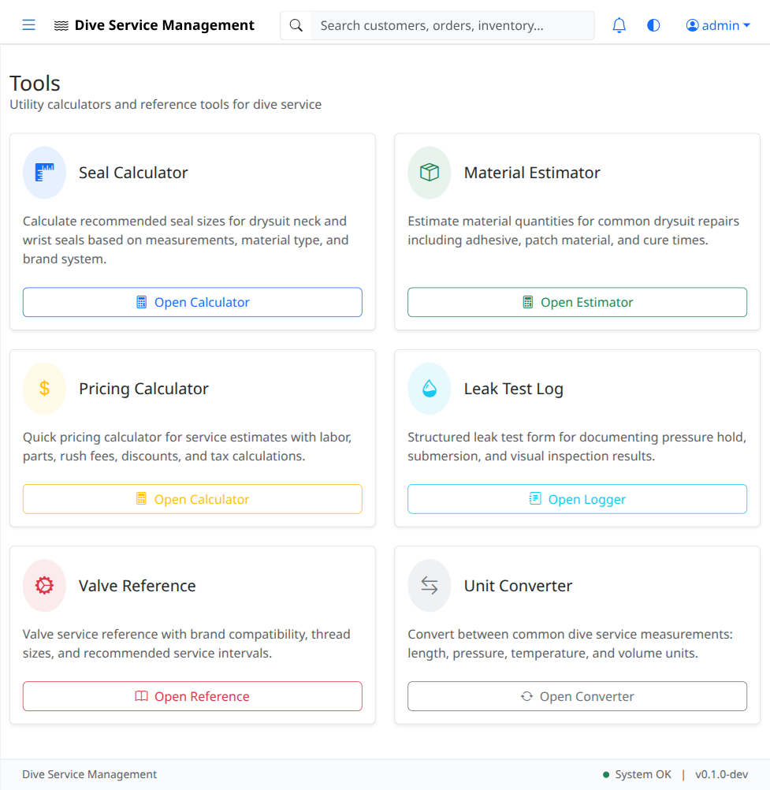
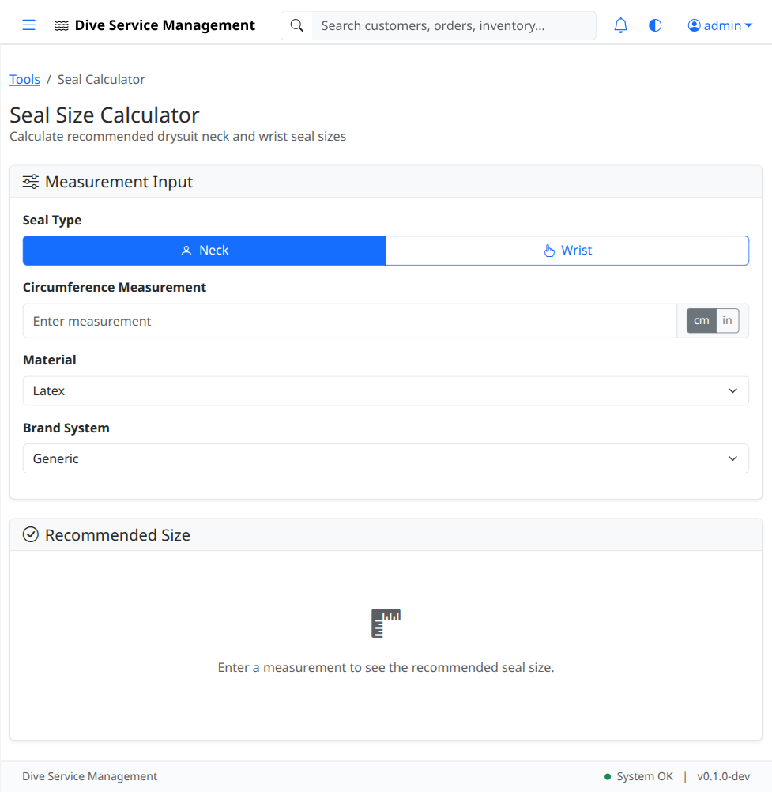
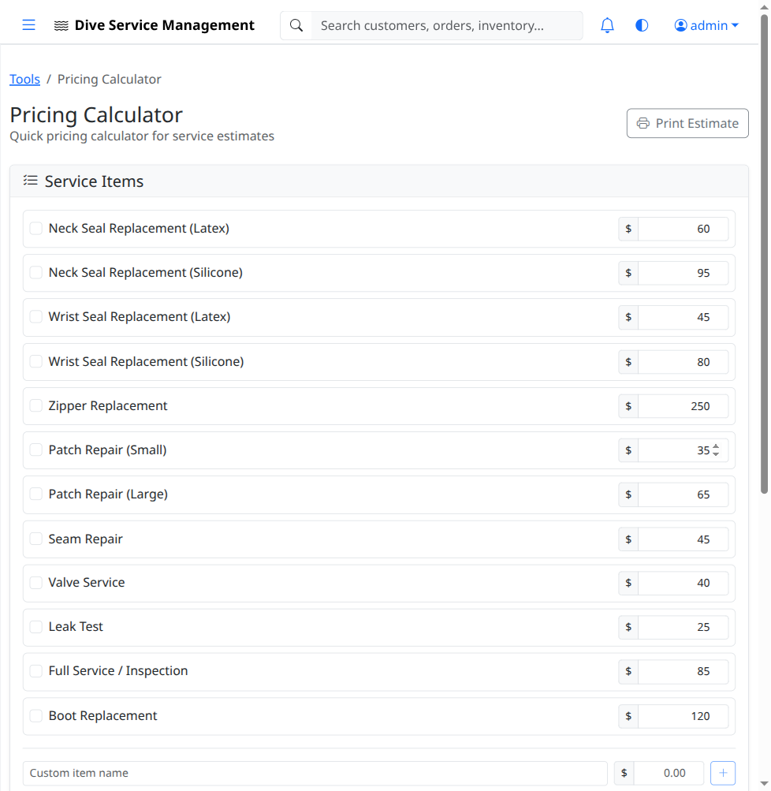
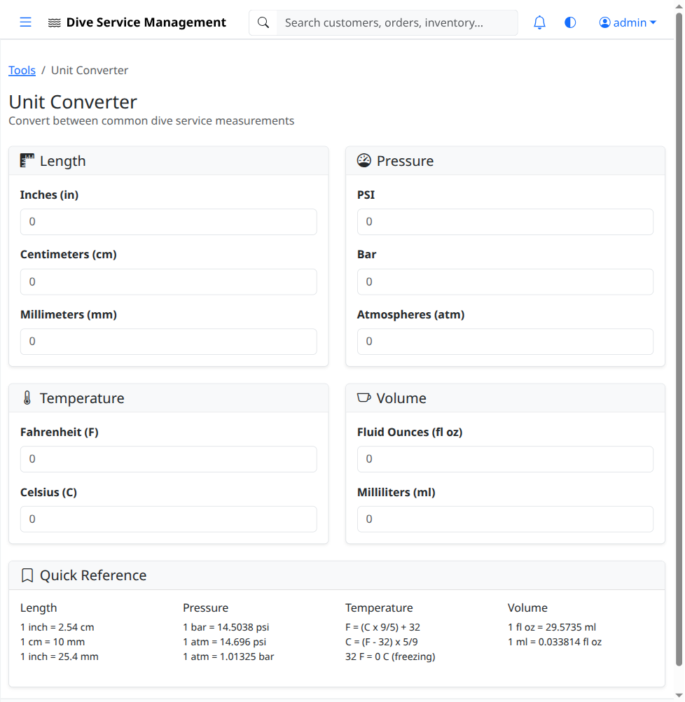

# UAT-09: Tools & Calculators

| Field            | Value                                      |
|------------------|--------------------------------------------|
| **UAT Script**   | UAT-09                                     |
| **Feature**      | Tools & Calculators                        |
| **Version**      | 1.0                                        |
| **Date Created** | 2026-03-04                                 |
| **Estimated Time** | 20 minutes                               |
| **Prerequisites** | UAT-01 completed (authentication works); Application running at http://localhost:8080 |
| **Test Account** | admin@example.com / admin123               |

---

## Objective

Verify that the Tools hub displays all 6 available tools, and that each tool loads and functions correctly. Test the Seal Calculator, Pricing Calculator, Unit Converter, Material Estimator, Leak Test Logger, and Valve Reference tools.

---

## Test Steps

### TC-09.1: Navigate to Tools Hub

1. Log in as **admin@example.com** / **admin123**.
2. Click **Tools** in the left sidebar.
3. Verify the tools hub page loads.
4. Verify the hub displays **6 tool cards**:
   - Seal Calculator
   - Pricing Calculator
   - Unit Converter
   - Material Estimator
   - Leak Test Logger
   - Valve Reference

- [ ] **Step passed** -- Tools hub page loads
- [ ] **Step passed** -- All 6 tool cards are displayed

---

### TC-09.2: Seal Calculator

1. Click the **Seal Calculator** card on the tools hub.
2. Verify the seal calculator page loads.
3. Test a **neck seal** calculation:
   - Select seal type: **Neck**
   - Enter neck measurement (e.g., `15` inches or as prompted by the form)
   - Click **"Calculate"** or equivalent button
4. Verify a seal size result is displayed (e.g., recommended seal size, trim line).
5. Test a **wrist seal** calculation:
   - Select seal type: **Wrist**
   - Enter wrist measurement (e.g., `7` inches or as prompted)
   - Click **"Calculate"**
6. Verify a seal size result is displayed.

- [ ] **Step passed** -- Seal calculator page loads
- [ ] **Step passed** -- Neck seal calculation returns a result
- [ ] **Step passed** -- Wrist seal calculation returns a result

---

### TC-09.3: Pricing Calculator

1. Navigate back to the **Tools** hub.
2. Click the **Pricing Calculator** card.
3. Verify the pricing calculator page loads.
4. Add items to the calculator:
   - Select or enter a service item (e.g., "Zipper Replacement")
   - Add another item (e.g., "Seal Replacement")
5. Verify individual item prices are displayed.
6. Verify the **total** is calculated correctly (sum of all added items).
7. Test removing an item and verify the total updates.

- [ ] **Step passed** -- Pricing calculator page loads
- [ ] **Step passed** -- Items can be added
- [ ] **Step passed** -- Total calculates correctly
- [ ] **Step passed** -- Removing an item updates the total

---

### TC-09.4: Unit Converter

1. Navigate back to the **Tools** hub.
2. Click the **Unit Converter** card.
3. Verify the unit converter page loads.
4. Test **length conversion**:
   - Convert **10 inches** to **millimeters**
   - Verify the result is approximately **254 mm**
5. Test **pressure conversion**:
   - Convert **14.7 PSI** to **bar**
   - Verify the result is approximately **1.01 bar**
6. Test other available conversions as applicable.

- [ ] **Step passed** -- Unit converter page loads
- [ ] **Step passed** -- Inches to millimeters conversion is correct
- [ ] **Step passed** -- PSI to bar conversion is correct

---

### TC-09.5: Material Estimator

1. Navigate back to the **Tools** hub.
2. Click the **Material Estimator** card.
3. Verify the material estimator page loads.
4. Test a material estimate:
   - Select a **repair type** (e.g., "Patch repair", "Seam repair", or as available)
   - Enter **dimensions** (e.g., length and width of the repair area)
   - Click **"Estimate"** or equivalent button
5. Verify the estimator returns material requirements (e.g., amount of adhesive, patch material size, etc.).

- [ ] **Step passed** -- Material estimator page loads
- [ ] **Step passed** -- Selecting repair type and entering dimensions works
- [ ] **Step passed** -- Estimator returns material requirements

---

### TC-09.6: Leak Test Logger

1. Navigate back to the **Tools** hub.
2. Click the **Leak Test Logger** card.
3. Verify the leak test logger page loads.
4. Fill in test data:
   - Enter test parameters as prompted by the form (e.g., initial pressure, test duration, final pressure, pass/fail criteria)
   - Fill in any additional fields (item tested, date, technician notes)
5. Submit the test data.
6. Verify the test result is saved or displayed (e.g., pass/fail determination, test log entry).

- [ ] **Step passed** -- Leak test logger page loads
- [ ] **Step passed** -- Test data can be entered
- [ ] **Step passed** -- Test result is saved or displayed

---

### TC-09.7: Valve Reference

1. Navigate back to the **Tools** hub.
2. Click the **Valve Reference** card.
3. Verify the valve reference page loads.
4. Browse the valve specifications:
   - Verify a list or table of valve types/brands is displayed
   - Click on a valve type to view detailed specifications
5. Verify specifications include relevant technical information (torque settings, thread types, part numbers, etc.).

- [ ] **Step passed** -- Valve reference page loads
- [ ] **Step passed** -- Valve types are listed
- [ ] **Step passed** -- Detailed specifications are available

---

### TC-09.8: Tool Navigation

1. From any individual tool page, verify there is a way to navigate back to the **Tools hub** (breadcrumb, back button, or sidebar).
2. Verify all 6 tools can be accessed sequentially without errors.

- [ ] **Step passed** -- Navigation back to Tools hub works from each tool
- [ ] **Step passed** -- All tools load without errors

---

## Test Summary

| Test Case | Description                     | Pass | Fail | Notes |
|-----------|---------------------------------|------|------|-------|
| TC-09.1   | Navigate to tools hub           |      |      |       |
| TC-09.2   | Seal calculator                 |      |      |       |
| TC-09.3   | Pricing calculator              |      |      |       |
| TC-09.4   | Unit converter                  |      |      |       |
| TC-09.5   | Material estimator              |      |      |       |
| TC-09.6   | Leak test logger                |      |      |       |
| TC-09.7   | Valve reference                 |      |      |       |
| TC-09.8   | Tool navigation                 |      |      |       |

---

## Notes

_Space for tester comments, observations, and issues encountered:_

    

---

**Tester Name:** ____________________
**Date Tested:** ____________________
**Overall Result:** PASS / FAIL
