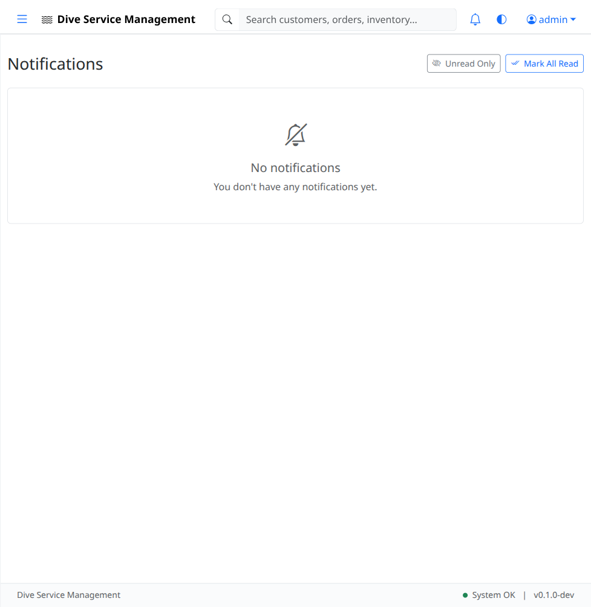

# UAT-10: Notifications

| Field            | Value                                      |
|------------------|--------------------------------------------|
| **UAT Script**   | UAT-10                                     |
| **Feature**      | Notifications System                       |
| **Version**      | 1.0                                        |
| **Date Created** | 2026-03-04                                 |
| **Estimated Time** | 15 minutes                               |
| **Prerequisites** | UAT-01 completed (authentication works); UAT-07 recommended (invoices exist for generating payment notifications); Application running at http://localhost:8080 |
| **Test Account** | admin@example.com / admin123               |

---

## Objective

Verify that the notification system works correctly, including the notification bell indicator in the header, the notification dropdown, the full notification list page, the "Mark All Read" functionality, and that relevant application activities generate notifications.

---

## Test Steps

### TC-10.1: Notification Bell in Header

1. Log in as **admin@example.com** / **admin123**.
2. Look at the top header/navigation bar.
3. Verify a **notification bell icon** is present.
4. Note whether the bell shows a badge/count indicator (this depends on whether there are unread notifications).

- [ ] **Step passed** -- Notification bell icon is visible in the header

---

### TC-10.2: Notification Dropdown

1. Click the **notification bell** icon in the header.
2. Verify a dropdown menu appears.
3. If there are notifications, verify they display with:
   - A brief message or title
   - A timestamp
4. If there are no notifications, verify the dropdown displays **"No new notifications"** or similar empty state.

- [ ] **Step passed** -- Notification dropdown opens on bell click
- [ ] **Step passed** -- Dropdown shows notifications or empty state message

---

### TC-10.3: Navigate to Notifications Page

1. Navigate to the full notifications page at **http://localhost:8080/notifications/** (or click a "View All" link in the dropdown if available).
2. Verify the notifications list page loads.
3. Verify the page displays a list of all notifications (or an empty state if none exist).

- [ ] **Step passed** -- Notifications list page loads
- [ ] **Step passed** -- Notification list displays correctly

---

### TC-10.4: Mark All Read

1. On the notifications list page, look for a **"Mark All Read"** button.
2. If there are unread notifications, click **"Mark All Read"**.
3. Verify all notifications are marked as read (visual change: no longer bold, badge count clears, etc.).
4. Verify the notification bell in the header no longer shows an unread count badge (or shows 0).

- [ ] **Step passed** -- "Mark All Read" button is present
- [ ] **Step passed** -- All notifications are marked as read after clicking
- [ ] **Step passed** -- Header bell badge clears

---

### TC-10.5: Generate a Notification via Activity

1. Perform an action that should generate a notification. For example:
   - Navigate to **Invoices** and open an existing invoice.
   - **Record a payment** on the invoice (fill in amount, date, method, and click "Record Payment").
2. After recording the payment, navigate to the notifications page or click the notification bell.
3. Verify a new notification appears related to the payment (e.g., "Payment of $X recorded on invoice INV-XXXX").

- [ ] **Step passed** -- Activity (payment) triggers a notification
- [ ] **Step passed** -- New notification appears in the dropdown or list

---

### TC-10.6: Notification as Unread

1. After the notification from TC-10.5 is generated, verify:
   - The notification bell in the header shows a badge/count (at least 1 unread).
   - The notification appears at the top of the list on the notifications page.
   - The notification is visually distinct as unread (e.g., bold text, highlighted background).

- [ ] **Step passed** -- New notification shows as unread with visual indicator
- [ ] **Step passed** -- Notification bell shows unread count

---

### TC-10.7: Mark Individual Notification as Read

1. On the notifications page, click on the unread notification from TC-10.5.
2. Verify the notification detail opens or the notification is marked as read.
3. Verify the visual indicator changes (no longer bold/highlighted).
4. Verify the bell badge count decrements by 1.

- [ ] **Step passed** -- Individual notification can be marked as read
- [ ] **Step passed** -- Badge count updates accordingly

---

### TC-10.8: Multiple Notifications

1. Perform several actions that generate notifications (e.g., create an order, record another payment, change an order status).
2. Navigate to the notifications page.
3. Verify all generated notifications appear.
4. Verify notifications are in **reverse chronological order** (newest first).
5. Click **"Mark All Read"**.
6. Verify all notifications are marked as read.

- [ ] **Step passed** -- Multiple notifications are generated
- [ ] **Step passed** -- Notifications display in reverse chronological order
- [ ] **Step passed** -- "Mark All Read" clears all unread notifications

---

## Test Summary

| Test Case | Description                              | Pass | Fail | Notes |
|-----------|------------------------------------------|------|------|-------|
| TC-10.1   | Notification bell in header              |      |      |       |
| TC-10.2   | Notification dropdown                    |      |      |       |
| TC-10.3   | Navigate to notifications page           |      |      |       |
| TC-10.4   | Mark all read                            |      |      |       |
| TC-10.5   | Generate notification via activity       |      |      |       |
| TC-10.6   | Notification as unread                   |      |      |       |
| TC-10.7   | Mark individual notification as read     |      |      |       |
| TC-10.8   | Multiple notifications                   |      |      |       |

---

## Notes

_Space for tester comments, observations, and issues encountered:_

    

---

**Tester Name:** ____________________
**Date Tested:** ____________________
**Overall Result:** PASS / FAIL
